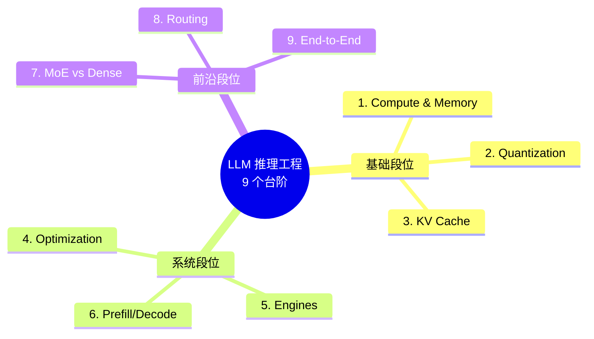

# 9 步走完 LLM 推理工程（上）：为什么你该做 Inference Engineer

> **系列导航**：[中篇·节点 4-6（系统段位）](@/blog/inference-engineering/inference-engineering-series-01-b-roadmap.md) | [下篇·节点 7-9 + 4 周路径](@/blog/inference-engineering/inference-engineering-series-01-c-roadmap.md)
> **完整长文**：[Inference Engineering 学习路线总结](@/blog/inference-engineering/inference-engineering-series-00-roadmap-summary.md)

---

## 一句话开场

> **做 AI 应用的人很多，做"让 AI 跑得起来 / 跑得便宜 / 跑得稳"的人很少。**

打开 LinkedIn，2026 年最缺的不是 Prompt Engineer、也不是 RAG 架构师——而是 **Inference Engineer**。Anyscale、Modal、Together、Fireworks、字节豆包、阿里 PAI、腾讯 TI……每家都在抢。年薪百万，还是招不到。

为什么？因为绝大多数 LLM 教程都在教**怎么调 API**，没人在教**怎么让模型跑起来**。

今天开始一个 **3 篇系列**，拆一份国外 AI 工程师都在用的 Inference Engineering 路线图——9 个节点，从硅片（FLOPs / 显存）到生产部署（vLLM / 路由 / 端到端），按图索骥即可。

> 本篇（上）讲**基础段位 1-3**：Compute & Memory / Quantization / KV Cache。这是所有优化的地基。

---

## 9 节点总览（Mermaid 心智图）

> 完整心智图见 [公众号文-01-配图大纲.md](#)。

---

## 节点 1 · Inference Compute & Memory（推理算力与显存）

**它解决什么**：模型到底吃多少 FLOPs？显存峰值怎么算？为什么 7B 模型单卡 A100 跑不起来，70B 模型必须量化？

**核心公式族**：

- **Prefill 阶段**：`FLOPs ≈ 2 × N_params × tokens`（密集矩阵乘）
- **Decode 阶段**：`FLOPs/token ≈ 2 × N_params`（受 memory-bound 限制）
- **显存**：`显存 ≈ weights + KV cache + activations + overhead`

**工程师笔记**：

> 把这两套算清楚就能**预测**任何 GPU 配置下的吞吐上限和 OOM 风险——不用每次都靠试错。
> 选卡采购时盯一个指标：**`tokens/s/$`**（每美元吞吐量），不是裸硬件价格。
> Llama-3-70B FP16 weights ~140GB，KV cache 在 `seq=4k, batch=8` 时再加 ~30GB——这就能解释为什么必须做张量并行 + 量化 + PagedAttention。

**资源**：[Transformer Inference Arithmetic](https://kipp.ly/p/transformer-inference-arithmetic)

---

## 节点 2 · Quantization Basics（量化基础）

**它解决什么**：FP16/FP32 太重怎么办？INT8 / INT4 / FP8 / AWQ / GPTQ / GGUF 这些后缀到底什么意思？

**三条主流路径**：

| 路径 | 代表算法 | 何时用 |
|---|---|---|
| **PTQ**（训后量化） | GPTQ / AWQ / SmoothQuant | 通用首选，< 1% 质量损失 |
| **QAT**（训练感知量化） | LLM-QAT / BitDistiller | PTQ 掉点严重时（< 0.5% 损失） |
| **Weight-only vs Weight+Activation** | AWQ / SmoothQuant | 显存优先选 Weight-only，速度优先选 W+A |

**工程师笔记**：

> **生产默认起步**：**W4A16**（权重 INT4，激活 FP16）——Llama-3-70B 压到 ~35GB，单卡 H100 能跑。
> **量化要进 CI**：必须有 `ppl`（困惑度）+ 业务 eval 回归集，**不能只看显存**。
> **避坑**：AWQ 对 MoE 不友好；GGUF + llama.cpp 是边缘部署事实标准。

**资源**：[A Visual Guide to Quantization](https://newsletter.maartengrootendorst.com/p/a-visual-guide-to-quantization)

---

## 节点 3 · KV Cache（KV 缓存）

**它解决什么**：为什么生成式推理必须 memory-bound？为什么 `max_seq_len` 设大了就 OOM？

**关键洞察**：

- 每个 token 的生成需要把**之前所有 token 的 K/V 矩阵**重过一遍注意力
- **显存随序列长度线性增长**，且每次只新增一行的 K/V
- **PagedAttention**（vLLM 核心发明）= 把 KV cache 切成不连续物理页

**工程师笔记**：

> 长上下文（>32k）的成本曲线**不是线性的**——KV cache 可能比 weights 还大。
> **GQA**（Grouped-Query Attention）把 KV 头数砍到原来的 1/8，**显存直降 4~8 倍**，Llama-2/3、Mixtral 都用了。
> **本系列下篇会用整个第二篇展开 KV Cache 第一性原理 + 算账**（Qwen-72B 单请求 80GB KV）。

**资源**：[KV Cache in LLM Inference](https://pub.towardsai.net/kv-cache-in-llm-inference-7b904a2a6982)

---

## 国内大厂案例 · DeepSeek MLA（节点 3 范例）

> DeepSeek-V2 用了一项叫 **MLA（Multi-head Latent Attention）** 的黑科技：把 KV cache 压缩到一个低秩潜在空间。**相比标准 MHA，KV cache 减少 ~93%**，模型质量几乎不掉。
>
> 直接结果：DeepSeek-V2 API 价格 $0.14 / 百万 input tokens——**比 GPT-4 Turbo 便宜 30 倍以上**，让 2024 年整个国内大模型 API 价格跳水。
>
> **工程师视角**：这是节点 3"KV Cache"在工业界的最佳实践——**不是简单调 PagedAttention，而是在模型架构层面把 K/V 投影矩阵换成低秩分解**，从根上砍掉 KV cache。

---

## 本篇小结 + 下篇预告

| 节点 | 一句话 | 上篇搞清了吗 |
|---|---|---|
| 1 · Compute & Memory | **算清楚** FLOPs 和显存峰值 | ✓ |
| 2 · Quantization | **压得动** 70B 到单卡 | ✓ |
| 3 · KV Cache | **存下来** 历史的 K/V | ✓ 初步 |

**下篇预告（中）**：节点 4-6 系统段位——**怎么让模型跑得快 / 怎么选引擎 / Prefill 与 Decode 怎么拆开优化**。包括 vLLM vs SGLang vs TensorRT-LLM 的选型矩阵。

**互动**：你在生产上跑 LLM 推理时，遇到过最棘手的显存问题是什么？评论区聊聊。

---

*本系列来源：@itsmenikhitha / Twitter (路线图) + 原创工程视角 + 国内大厂案例*
*风格：长文 + 翻译原文 + 中文工程视角 + 结构化对照表*
*系列 1/3 · 9 节点基础段位*
