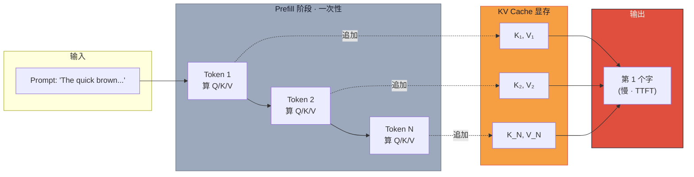

# 为什么 ChatGPT 第一个字永远慢（上）：从生成机制到 O(n²) 冗余

> **系列导航**：[中篇·KV Cache 修复 + TTFT](@/blog/inference-engineering/inference-engineering-series-02-b-kvcache.md) | [下篇·显存代价 + 救兵技术](@/blog/inference-engineering/inference-engineering-series-02-c-kvcache.md)
> **完整长文**：[KV Cache 第一性原理完整版](#)

---

## 一句话开场

> **每一次你打开 ChatGPT，第一个 token 都要等一下。后面的字却能"刷"地一下出来。**
> **——这不是 UI 的 bug，这是一个叫 KV Caching 的工程决策，它让 LLM 推理快了大约 5 倍。**

今天开始一个 **3 篇系列**，拆一篇硬核 KV Cache 第一性原理图解——6 段 GIF 动画，从"为什么 ChatGPT 第一个字慢"一路追到"用显存换时间"的工程真相。

> 本篇（上）讲**机制 1-3**：LLM 怎么生成 token / 注意力到底在算什么 / 隐藏的 O(n²) 冗余。

---

## Part 1 · LLM 是怎么生成 token 的

**原文**：
> Transformer 处理所有输入 token，为每个 token 生成一个 hidden state。
> 这些 hidden state 被投影到 vocabulary 空间，产生 **logits**（每个词一个分数）。
> 但**只有最后一个 token 的 logits** 起作用。
> 你从中采样 → 得到下一个 token → 拼接到输入末尾 → 重复。

**关键洞察**：

> **要生成下一个 token，你只需要最新一个 token 的 hidden state。其他所有 hidden state 都是中间产物。**

**工程师视角**：

> 这是为什么 LLM 推理**不能像训练一样大批量并行**——生成是 sequential 的。
> 也是为什么"中间位置的 hidden state"看起来"算完就丢"——**算上但扔掉 vs 不算 vs 缓存起来**，是三种截然不同的取舍，**KV Cache 是第三种**。

---

## Part 2 · 注意力到底在算什么

**原文**：

在每个 transformer 层，每个 token 得到三个向量：**Q**（query）、**K**（key）、**V**（value）。

注意力机制 = Q × K^T → 分数 → 权重乘 V。

**现在只看最后一个 token**：

- `QK^T` 的最后一行用：
  - 最后一个 token 的 query 向量
  - **所有** key 向量
- 最终注意力输出用：
  - 同一个 query 向量
  - **所有** key 和 value 向量

**所以：要计算我们唯一需要的 hidden state，每一层注意力都需要**最新的 Q，历史所有的 K 和 V**。**

**工程师视角**：

> **这就是 KV Cache 存在的全部理由**——K 和 V 是**会被反复复用**的，而 Q 每次都是新的。
> Q 不能缓存（每个新 token 都有自己的 Q），K 和 V **可以且应该**缓存。
> 用公式写：`Attention(Q_last, K_1..t, V_1..t) → hidden_state_for_next_token`

---

## Part 3 · 冗余：O(n²) 的浪费

**原文**：

> 生成 token 50 需要 token 1~50 的 K 和 V。
> 生成 token 51 需要 token 1~51 的 K 和 V。
> Token 1~49 的 K 和 V **已经算过**、**不会变**、**输入相同、输出相同**。
> 但模型每一步都从头重算。
> **这是每步 O(n) 的冗余，整轮生成下来是 O(n²) 的浪费。**

**工程师视角**：

> 在 Llama-3-70B 上，n=2048 就要算 4M 次 Q/K/V 矩阵乘——**纯粹浪费**。
> 在 H100 上一次 4096×4096×8192 的矩阵乘约 ~2ms，O(n²) 的累计开销对 1000 token 的回复就是 1+ 秒——这就是 ChatGPT 不用 KV Cache 会"卡顿"的原因。

**一句话总结**：

> KV Cache 优化前的 naive 实现：**每生成一个 token 都要重算所有历史的 K/V**。**O(n²) 复杂度**——这不是"慢一点"，是"指数级不可用"。

---

## 国内大厂案例 · DeepSeek MLA（Part 3 范例 · KV Cache 极限压缩）

> DeepSeek-V2 用了一项叫 **MLA（Multi-head Latent Attention）** 的黑科技：把 KV cache 压缩到一个**低秩潜在空间**。
>
> 公开数据：
> - **MLA 把 KV cache 压缩到标准 MHA 的 ~7%**（即减少 93%）
> - 同样的 KV 显存预算，**batch size 可以扩大 14.6×**
> - 同样的 batch size，**decode 吞吐提升 ~5.76×**
>
> 直接结果：DeepSeek-V2 API 价格 $0.14 / 百万 input tokens——**比 GPT-4 Turbo 便宜 30 倍以上**。
>
> **工程师视角**：MLA 不是简单的"算一次存下来"，而是**从模型架构层面把 K/V 投影矩阵换成低秩分解**——这是 Part 3"O(n²) 冗余"的**根治方案**，不是治标。

---

## 数据流图（Mermaid 直接渲染版）

> 完整数据流图（含 Decode 阶段 + 显存账柱状图）见 [公众号文-02-配图大纲.md](#)。

---

## 本篇小结 + 下篇预告

| Part | 一句话 | 上篇搞清了吗 |
|---|---|---|
| 1 · 生成机制 | **sequential** + 最后一位 hidden state 决定下一个 token | ✓ |
| 2 · 注意力计算 | **Q 新的，K/V 复用** | ✓ |
| 3 · O(n²) 冗余 | **每步重算所有 K/V 不可接受** | ✓ |

**下篇预告（中）**：Part 4-5 **修复方案 + TTFT**——**KV Cache 的 4 步流程** / **为什么 Prefill 决定首字延迟** / **延迟账怎么算**。

**互动**：你团队生产环境的 KV cache 大小能算清楚吗？**在评论区贴一下：模型 + context + 并发**——我帮你估算显存。

---

*本系列来源：@akshay_pachaar / Twitter (KV Cache 图解) + 原创工程视角 + 国内大厂案例*
*风格：长文 + 翻译原文 + 中文工程视角 + 结构化对照表*
*系列 1/3 · KV Cache 机制篇*
