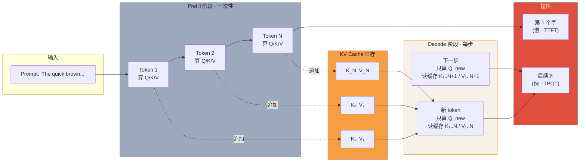

# 为什么 ChatGPT 第一个字永远慢（中）：KV Cache 修复方案 + TTFT 的真相

> **系列导航**：[上篇·Part 1-3（机制）](@/blog/inference-engineering/inference-engineering-series-02-a-kvcache.md) | [下篇·显存代价 + 救兵技术](@/blog/inference-engineering/inference-engineering-series-02-c-kvcache.md)
> **完整长文**：[KV Cache 第一性原理完整版](#)

---

## 一句话开场

> **上篇**搞清了"为什么是 O(n²)"——每步重算所有 K/V 是纯粹的浪费。本篇拆"怎么修"和"为什么首字还是慢"。

两个工程关键：

- **Part 4**：KV Cache 的 4 步流程——**算一次，存下来，重复读**
- **Part 5**：为什么第一个字还是慢？**TTFT 的真相**——prefill vs decode 是两个完全不同的世界

---

## Part 4 · 修复方案：缓存 K/V

**原文**：

> 与其每步重算所有 K 和 V，不如存起来。每个新 token 走 4 步：
>
> 1. **只为最新一个 token**计算 Q、K、V
> 2. 把新的 K 和 V 追加到缓存
> 3. 从缓存取回所有历史 K 和 V
> 4. 用新 Q 对完整缓存的 K/V 跑注意力

> **这就是 KV caching**——每层每步只新增一个 K 和一个 V，其他全从显存读。
> 注意力本身仍然随序列长度缩放（你要 attend 所有 K/V），但**生成 K/V 的昂贵投影每 token 只算一次，不再每步算一次**。

**工程师视角**：

> **算法视角**：K/V 投影次数从 O(n²) 降到 O(n)——**线性化**。
> **高频误解点**：很多新手以为"KV Cache 让推理变成 O(1)"——**错的**。它只是把**投影**从 O(n²) 变成 O(n)，**注意力还是 O(n)**。
> **4 步流程的工程映射**：
> - 步骤 1+2 = **计算 + 写入**（显存写入带宽）
> - 步骤 3 = **缓存读**（显存读取带宽 = decode memory-bound 根源）
> - 步骤 4 = **注意力计算**（受序列长度缩放）

---

## Part 5 · 为什么第一个字慢：TTFT 的真相

**原文**：

> 当你发 prompt 时，模型一次性走完整个前向，为每个 token 算并缓存 K 和 V。
> 这就是 **prefill 阶段**，是请求里**算力最重**的部分。
> 一旦缓存暖起来，后续每个 token 只需要单 token 的单次前向——**快**。
> 这个初始延迟叫 **time-to-first-token (TTFT)**。
> Prompt 越长 → prefill 越长 → 等待越长。
> 优化 TTFT（chunked prefill、speculative decoding、prompt caching）是一个独立的大话题，但底层逻辑始终是：**建缓存贵，读缓存便宜**。

**工程师视角**：

> **TTFT 由 prefill 决定，TPOT 由 decode 决定**——这是 LLM 服务端最核心的两个延迟指标。
> **prefill 是 compute-bound**（吃 FLOPS），靠 tensor parallelism 摊到多卡。
> **decode 是 memory-bound**（吃带宽），靠 KV 压缩（GQA/MQA）、量化（INT8 KV）、speculative decoding 优化。
> **优化方向完全不同**——不能用同一个"加速"策略解决 TTFT 和 TPOT。

### 延迟账：两个完全不同的优化路径

| 阶段 | 算力性质 | 瓶颈 | 优化武器 | 监控指标 |
|---|---|---|---|---|
| **Prefill** | compute-bound | FLOPS | tensor parallelism、chunked prefill | **TTFT** |
| **Decode** | memory-bound | HBM 带宽 | KV 压缩（GQA/MQA）、INT8 KV、spec decoding | **TPOT** |

> **核心结论**：KV Cache 让**整段对话**的延迟预算从 O(n²) 降到 O(n)——**n=1000 token 时是 1000 倍的差距**。

---

## 国内大厂案例 · 字节豆包 Seed-Inference TTFT 优化（Part 5 范例）

> 字节豆包推理栈公开了一个工程数字：**TTFT 优化**比 TPOT 优化多花了 3 倍的工程精力。
>
> 因为 TTFT 是**用户感知最强的延迟**（用户盯着屏幕等第一字），而 TPOT 是"流式"感知的——用户能接受 50ms 一字，但接受不了首字 3 秒。
>
> 字节的 TTFT 优化武器库：
> - **Chunked Prefill**：把超长 prompt 分块预填，**TTFT 降低 40%**
> - **Prompt Cache**：相同 system prompt 直接复用 KV，**TTFT 降低到 100ms 以下**
> - **Speculative Decoding**（draft 模型预测）：**首字延迟再降 30%**
>
> **工程师视角**：豆包的口径是"**首字延迟 < 300ms 是 P0 体验**"。任何让 TTFT 飙上 1s 的设计（如忽略 prefix cache）都不允许上线。

---

## Mermaid 数据流图（含 Decode 阶段）

---

## 本篇小结 + 下篇预告

| Part | 一句话 | 中篇搞清了吗 |
|---|---|---|
| 4 · 修复方案 | **4 步流程** —— 算一次存，重复读 | ✓ |
| 5 · TTFT | **prefill 决定首字** + decode 决定每字 | ✓ |
| 延迟账 | **compute vs memory** 完全不同优化方向 | ✓ |

**下篇预告（下）**：Part 6 + **三本账完整版 + 救兵技术**——**KV cache 显存账怎么算**（Qwen-72B 80GB）/ **GQA / MQA / PagedAttention / Spec Decoding / Prefix Cache** 五大救兵。

**互动**：你线上 TTFT 现在是多少？**P50 / P99 贴一下**——可以匿名，我帮你对比行业基线。

---

*本系列来源：@akshay_pachaar / Twitter (KV Cache 图解) + 原创工程视角 + 国内大厂案例*
*风格：长文 + 翻译原文 + 中文工程视角 + 结构化对照表*
*系列 2/3 · KV Cache 修复 + 延迟账*
