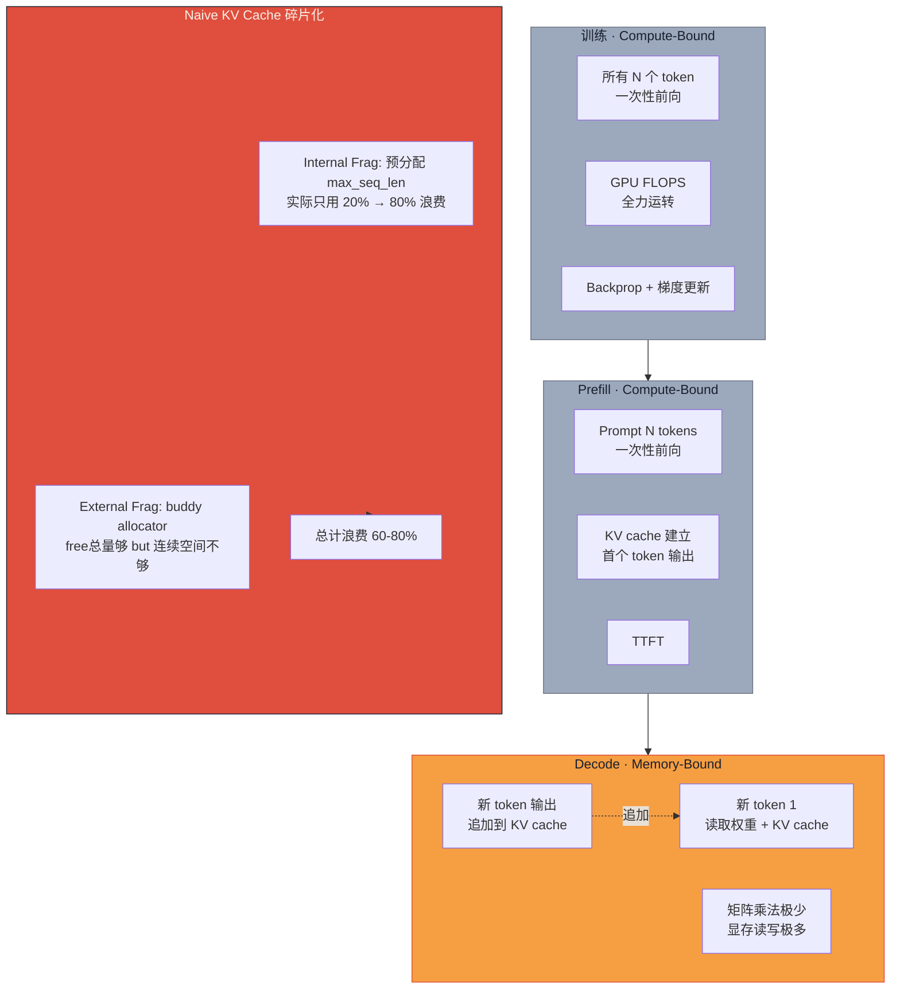

# Paged Attention 上篇：从 60-80% 显存浪费到 <4% 的工程革命

> **系列导航**：[中篇·vLLM 实现 + 性能数据复现](@/blog/inference-engineering/inference-engineering-series-03-b-paged-attention.md) | [下篇·配套技术全景（MQA/GQA/MLA/GTA + continuous batching + spec decoding）](@/blog/inference-engineering/inference-engineering-series-03-c-paged-attention.md)
> **完整长文**：[公众号文-03-Paged-Attention-详解](#)

---

## 一句话开场

> **为什么你的 80GB H100 跑 LLaMA-2-13B 只能并发 4 个请求，而 vLLM 能跑到 16 个？**
> **——答案藏在"OS 虚拟内存"这个 60 年前的发明里。**

本篇（上）讲**机制**：训练 vs 推理的本质差异 / prefill + decode 两阶段 / KV cache 为什么非上不可 / naive KV cache 的 60-80% 显存碎片化难题。

---

## Part 1 · 训练是 compute-bound，推理是 memory-bound

**原文**：

> Large language models are trained in highly parallel, compute-bound workloads, but serving them is very different: inference is memory-bound and sequential.

**关键洞察**：

> **训练**：所有 token 同时参与前向传播，GPU 所有计算核心全力运转——增加算力直接加速训练，**内存带宽不是瓶颈**。
>
> **推理**：新 token 必须等上一个 token 生成出来，顺序执行；每次 decode 步骤都要把模型权重和 KV 缓存从显存读出来——**数据搬运比数学计算更贵**。

**工程师视角**：

| 阶段 | 瓶颈类型 | 核心矛盾 | 优化方向 |
|---|---|---|---|
| 训练 | compute-bound | 算力不足 | 增加 GPU / FLOPS 利用率 |
| 推理（decode） | memory-bound | 带宽不足 | 减少 KV cache 体积 / 碎片 |

> 这就是为什么 A100 训练快、推理却还是慢——**架构没有变，变的是 workload 特性**。
> 训练和推理的优化策略是**完全不同的两套武功**，混用会翻车。

---

## Part 2 · 推理两阶段：prefill（计算） + decode（内存）

**原文**：

> The entire inference process is split into two phases:
> - **Prefill (prompt phase)**: The model reads the entire input prompt and prepares to generate the first token.
> - **Decoding**: The iterative loop where tokens are produced one by one sequentially.

**Prefill 阶段**：

- 整个 prompt 的 N 个 token 一次前向跑完
- 矩阵乘法 workload，GPU 计算单元饱满——**compute-bound**，类似训练
- 产出第一个 token（TTFT，time-to-first-token）以及每个 prompt token 的 KV

**Decode 阶段**：

- 逐 token 生成，每个 decode step 只处理一个（或者 speculative decoding 下的几个）新 token
- 每步需要读：模型权重 + 完整 KV cache
- GPU 在搬运数据，不是在做计算——**memory-bound**

**工程师视角**：

> TTFT（首字延迟）由 prefill 决定，是用户感知最强的指标。
> TPOT（每 token 延迟）由 decode 决定，是流式体验的核心。
> **两者的优化策略完全不同**——prefill 靠 tensor parallelism 摊多卡，decode 靠 KV 压缩（PagedAttention / GQA / 量化）。

---

## Part 3 · 为什么需要 KV cache：O(n²) 冗余消亡史

**原文**：

> With caching, the model only needs to handle the 1000 prompt tokens once and then compute each of the 100 new tokens on top, for a total of just 1,100 computations, nearly two orders of magnitude less work.

**原文数学**：

假设 prompt = 1000 tokens，输出 = 100 tokens：

- **无 KV cache**：1000 + 1001 + 1002 + ... + 1099 ≈ **100,000 token 计算**（O(n²) 量级）
- **有 KV cache**：1000（prefill） + 100（decode） = **1,100 token 计算**（O(n) 量级）

> 这就是 KV cache 存在的全部理由：**消除重复的 K/V 投影计算，把 O(n²) 降到 O(n)**

**KV cache 显存公式（原文核心公式）**：

$$
KV_{cache} = 2 \times bytes \times n_{layers} \times B \times n_{kv\_heads} \times d_{head} \times n_{seq}
$$

其中 2 = Key + Value 各一份。

**LLaMA-2-13B 实际算账**（原文数据）：

| 参数 | 值 |
|---|---|
| 模型 | LLaMA-2-13B |
| n_layers | 40 |
| n_heads / n_kv_heads | 40 / 40（标准 MHA） |
| d_head | 5120 / 40 = **128** |
| 精度 | FP16（2 bytes） |
| seq_len | 4096 |
| **单 token KV cache** | 0.78125 MiB/token |
| **单请求 4096 ctx KV cache** | **3.125 GiB / 请求** |

> 这就是为什么 LLaMA-2-13B 跑 8K context 时，一张 H100 80GB 只能跑很少并发——**单请求 KV cache 就 6.25 GiB**，加上模型权重 26GB，直接接近显存上限。

---

## Part 4 · Naive KV cache 的两难：限制 batch + 60-80% 碎片

**原文**：

> Prior systems wasted **60-80%** of this memory due to fragmentation, limiting throughput.

### 问题 A：显存随 seq_len 线性增长 → batch 受限

**原文**：

> The KV cache's memory usage scales linearly with sequence length, consuming substantial GPU memory.

公式（重复）：$KV_{cache} \propto n_{seq}$

- seq_len 增加 2x → 单请求 KV cache 增加 2x → 能跑的并发减少 2x
- 长 context 场景（32K / 128K）直接让并发归零

### 问题 B：内部碎片 + 外部碎片（原文配图详解）

**原文**：

> Two primary sources of memory waste:
> 1. **Internal fragmentation**: Reserved slots for future tokens go unused when generation finishes early.
> 2. **External fragmentation**: Memory allocator splits memory into non-contiguous blocks that cannot satisfy new requests.

**内部碎片的例子**：

```
请求 A 预估最大输出 1024 tokens → 预分配 1024 token 的 KV slab
实际只生成 128 tokens → 剩下 896 token 的槽位完全浪费

内部碎片率 = (1024 - 128) / 1024 = 87.5%
```

**外部碎片的 buddy allocator 例子**（原文逐步图解）：

```
初始：128 bytes free

Request A: needs 32 bytes  → split 128 → 分配 0-31（剩下 32-63, 64-127 free）
Request B: needs 16 bytes  → split 64-127 → 分配 64-79（剩下 80-95, 96-127 free）
Request C: needs 8 bytes   → split 32-63  → 分配 32-39（剩下 1 byte internal frag）

此刻：总共 free = 40-47(8) + 48-63(16) + 80-95(16) + 96-127(32) = 72 bytes
但 Request D: needs 64 bytes → 无法满足（没有连续 64 bytes block）→ allocation fails
这就是外部碎片——总量够，但无法满足请求
```

**原文数据（60-80% 浪费的来源）**：

> In continuous batching scenarios, because output sequence lengths are unknown in advance, serving platforms used to statically allocate a chunk of memory for each request based on its **maximum possible sequence length**, regardless of the actual input or the eventual output length.

**工程师视角**：

> **为什么 naive 分配策略必然导致 60-80% 浪费**：
>
> | 碎片来源 | 典型场景 | 浪费比例 |
> |---|---|---|
> | 内部碎片 | 预分配 max_seq_len=4096，实际只用了 128 tokens | ~90%+ |
> | 外部碎片 | buddy allocator 产生无法合并的小 block | 10-20% |
> | 两者叠加 | 高并发多请求混合 | **60-80% 总浪费** |
>
> **核心矛盾**：预估最大 seq_len 是防御性编程，但防御的是极端情况，代价是日常 80% 的浪费。

---

## 国内大厂案例 · DeepSeek MLA（根治碎片的架构方案）

> DeepSeek-V2 选择了和 vLLM 不同的路线：**不是优化 KV cache 的分配策略，而是从架构层面压缩 KV cache 体积**。

**MLA（Multi-head Latent Attention）核心思路**：

> MLA stores K and V in a learned low-dimensional latent space and projects in and out as needed.

**公开数据**：
- **KV cache 压缩到标准 MHA 的 ~7%**（减少 93%）
- 同样的 KV 显存预算，**batch size 可扩大 14.6×**
- 同样的 batch size，**decode 吞吐提升 ~5.76×**

**DeepSeek-V3 的 MLA 升级**：

- DeepSeek-V3 进一步把 MLA 和 **FP8 推理**结合
- 671B 总参数量，37B active per token，**单次 forward 只需 ~2GB HBM**（结合了 MLA 压缩 + FP8 量化）

**工程师视角**：

> vLLM 的 PagedAttention 是**工程层面的碎片优化**——解决"显存怎么分"的问题。
> DeepSeek MLA 是**架构层面的体积压缩**——解决"KV cache 有多少"的问题。
> **两条路都在走**，并不矛盾。PagedAttention + MLA = 当前最强的 KV cache 效率组合。

---

## 数据流图（Mermaid 直接渲染版）



---

## 本篇小结 + 下篇预告

| Part | 一句话 | 上篇搞清了吗 |
|---|---|---|
| 1 · 训练 vs 推理 | 训练 compute-bound / 推理 memory-bound，两套优化逻辑 | ✓ |
| 2 · prefill vs decode | prefill=计算密集（TTFT）/ decode=带宽密集（TPOT） | ✓ |
| 3 · KV cache 必要性 | O(n²) 重算 → O(n) 缓存，~100× 减少计算量 | ✓ |
| 4 · naive KV cache 碎片 | 内部碎片（预分配）+ 外部碎片（allocator）= 60-80% 浪费 | ✓ |

**下篇预告（中）**：Paged Attention 三件套——**block table**（逻辑→物理映射）+ **KV cache manager**（free pool）+ **paged attention kernel**；vLLM 实现细节；2-3x 吞吐复现；4% 浪费怎么算出来的。

**互动**：你生产环境的 H100 每卡能跑多少并发 LLaMA-2-13B？**评论区报一下模型 + context + 并发数**——我帮你算显存瓶颈在哪。

---

*风格沿用：[系列-02-A-KVCache-上篇](@/blog/inference-engineering/inference-engineering-series-02-a-kvcache.md)*
*系列：Paged Attention & Attention 内存效率 1/3*
*来源素材：Paged Attention from First Principles: A View Inside vLLM (Hamza El-Shafie, 2025-09-11)*
