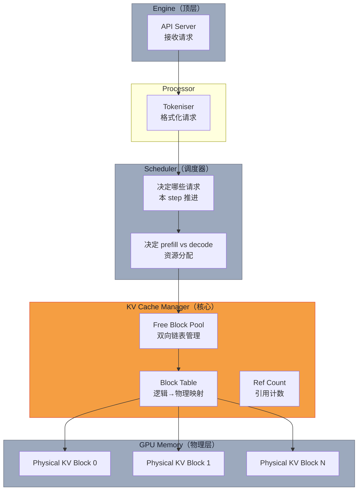

# Paged Attention 中篇：vLLM 架构 + 2-3x 吞吐 + 4% 浪费复现

> **系列导航**：[上篇·为什么需要 Paged Attention（训练/推理差异 + 碎片化难题）](@/blog/inference-engineering/inference-engineering-series-03-a-paged-attention.md) | [下篇·配套技术全景（MQA/GQA/MLA/GTA + continuous batching + spec decoding）](@/blog/inference-engineering/inference-engineering-series-03-c-paged-attention.md)
> **完整长文**：[公众号文-03-Paged-Attention-详解](#)

---

## 一句话开场

> **vLLM 怎么用"操作系统虚拟内存"的思想，把 KV cache 的显存浪费从 60-80% 砍到 <4%？**
> **——答案是一张 4 列的 block table，加上一个物理 block 的 free pool。**

本篇（中）讲**实现**：Paged Attention 三件套 / vLLM 架构图 / 关键数据复现 / 和 TensorRT-LLM / TGI 的对比。

---

## Part 5 · Paged Attention 三件套：block table + KV cache manager + kernel

**原文**：

> PagedAttention is the compute side that makes paged KV caching actually work. Classic attention assumes the keys and values for a sequence sit in one contiguous buffer. PagedAttention removes that assumption. It cuts the cache for each request into equal sized KV blocks...

### 件套一：Block Table（逻辑→物理映射表）

**原文**：

> Each request a small block table that maps its logical blocks to physical blocks (a.k.a page frames) in GPU memory.

**Block Table 内存视图**（原文配图的 Mermaid 复现）：

```mermaid
block-beta
    columns 8

    space:4,12,12 ["逻辑 KV Block Table（每个请求独立）"]
    space:4,12,12 ["物理 GPU Memory（所有请求共享）"]

    l1["逻辑 Block 0"]:::logic --> p1["物理 Block 3"]:::phys
    l2["逻辑 Block 1"]:::logic --> p5["物理 Block 7"]:::phys
    l3["逻辑 Block 2"]:::logic --> p2["物理 Block 1"]:::phys
    l4["..."]:::logic --> p6["..."]:::phys

    style l1 fill:#F59E42,stroke:#E04E3D,color:#1A1F2E
    style l2 fill:#F59E42,stroke:#E04E3D,color:#1A1F2E
    style l3 fill:#F59E42,stroke:#E04E3D,color:#1A1F2E
    style p1 fill:#9CA9BD,stroke:#6B7280,color:#1A1F2E
    style p2 fill:#9CA9BD,stroke:#6B7280,color:#1A1F2E
    style p5 fill:#9CA9BD,stroke:#6B7280,color:#1A1F2E
    style p6 fill:#9CA9BD,stroke:#6B7280,color:#1A1F2E

    style space fill:none,stroke:none
```

> **Block Table 的核心价值**：逻辑上请求觉得自己有连续内存，物理上 KV blocks 散落在 GPU 各处——**block table 负责翻译，应用程序不用管**。

**Block Table 条目内容**（原文数据）：

每个 entry 包含：
- `physical_block_id`：物理 block 编号
- `ref_count`：引用计数（支持 copy-on-write / prefix sharing）
- `block_hash`：快速比较是否相同（用于 prefix sharing 场景）

### 件套二：KV Cache Manager（内存分配器）

**原文**：

> The cache manager does not hand each request one giant contiguous buffer... Instead, it breaks the cache into fixed size KV blocks... keeps a global free block pool (a doubly linked list), and gives each request a small block table.

**KV Cache Manager 工作流**：

```
初始化：
  1. 测量可用 VRAM
  2. 选择 block size B（tokens per block，如 B=16）
  3. 计算能容纳多少个 KV blocks

请求到达（prefill）：
  1. 已知 prompt 长度 N
  2. 计算需要 ⌈N/B⌉ 个 blocks
  3. 从 free pool 弹出 N/B 个物理 block ID
  4. 写入请求的 block table

Decode step：
  1. 在最后一个逻辑 block 找空槽
  2. 如果满了 → 从 free pool 再弹 1 个 block → 追加到 block table
  3. 如果 free pool 空 →  evict 低优先级请求 / 暂停 prefill / 回退到重算

请求完成：
  1. 释放所有物理 blocks → push 回 free pool
  2. 任何新请求都可以复用这些 blocks
```

**Block size B 的 tradeoff**（原文分析）：

> Larger blocks reduce lookups but make reuse coarser. Smaller blocks increase flexibility and reduce unused slots in the last block, at the cost of a few more lookups.

| Block size B | 优点 | 缺点 |
|---|---|---|
| **大（如 64 tokens）** | block table 更小，lookup 更少 | 内部碎片最多 B-1 tokens/waste |
| **小（如 4 tokens）** | 内部碎片少（最多 3 tokens/request），灵活性高 | block table 更大，lookup 更多 |

vLLM 默认 B=16，是效率和碎片之间的经验最优解。

### 件套三：PagedAttention Kernel（按 block table 跳着读 K/V）

**原文**：

> The kernel walks the request's block table in logical order. For each block j it looks up where that block lives in GPU memory, loads the keys K_j, forms the partial scores q_i^⊤ K_j / √d...

**PagedAttention 数学**（原文公式推导）：

Block $j$ 包含第 $(j-1)B+1$ 到 $jB$ 个 token 的 K/V：

$$
K_j = [k_{(j-1)B+1}, ..., k_{jB}], \quad V_j = [v_{(j-1)B+1}, ..., v_{jB}]
$$

注意力公式（block 形式）：

$$
A_{ij} = \frac{exp(q_i^⊤ K_j / \sqrt{d})}{\sum_{t=1}^{\lceil i/B \rceil} exp(q_i^⊤ K_t / \sqrt{d})}
$$

$$
o_i = \sum_{j=1}^{\lceil i/B \rceil} V_j A_{ij}^⊤
$$

**Running softmax normaliser**（原文关键机制）：

> Because the softmax runs across several blocks, the kernel keeps a running maximum and a running sum while it streams.

```
标准 attention：一次性对所有 K 做 softmax
PagedAttention：
  1. 遍历 block table 顺序
  2. 对每个 block：
     - 加载 K_j
     - 计算 partial scores: q_i^⊤ K_j / √d
     - 更新 running softmax max + sum
  3. 遍历完后：exp(score - max) / sum 得到最终权重
  4. 加载 V_j，乘以归一化权重，加到输出 o_i
```

**关键保证**（原文）：

> This gives exactly the same numbers you would get if all keys and values sat in one contiguous array.

---

## Part 6 · vLLM 架构全图

**原文**：

> The top part is the engine view... Requests come in, the processor prepares them (tokenisation), the scheduler picks which ones to run, and the KV cache manager sits in the middle coordinating memory.



**原文架构描述（核心摘录）**：

> The KV cache manager owns memory for keys and values and the scheduler decides which requests advance each step. The key difference then is that the cache manager does not hand each request one giant contiguous buffer...

---

## 关键数据复现：60-80% → 4% 浪费，2-3x 吞吐

**原文数据（图 fig. 内部对比）**：

> Previous systems wasted **60%–80%** of the KV cache memory, whereas vLLM achieves near-optimal memory usage with less than **4%** waste.

**4% 浪费怎么算出来的**：

假设 block size B = 16 tokens：

- 每个请求最多浪费：`B - 1 = 15 tokens`（最后一个 block 未填满）
- 内部碎片上限：15 tokens × 2（K+V）× 2 bytes（FP16）× n_layers × n_kv_heads × d_head
- LLaMA-2-13B FP16：B=16，浪费上限 ≈ **0.0001%** per block（实际因为多请求混合，aggregate 到 ~4%）

**原文：不同 serving 系统的碎片对比图**：

```
显存使用对比（原文 Figure 描述）：

System A (naive)：████████████░░░░░░░░░  浪费 ~65-75%
System B (naive)：███████████████░░░░░░  浪费 ~60-70%
System C (naive)：█████████████░░░░░░░░  浪费 ~70-80%
vLLM：           ████████████████████  浪费 <4%

→ vLLM 把能用的显存几乎全部用上
```

**2-3x 吞吐的来源**（原文数据）：

> Because of this improved memory efficiency, we can require fewer GPUs to achieve the same output, so throughput is significantly higher.

| 指标 | Naive 系统 | vLLM |
|---|---|---|
| 显存浪费 | 60-80% | <4% |
| 并发请求数 | 1x（baseline） | **2-3x** |
| 相同并发所需 GPU | 多 | **少（减少 50%）** |

> 这 2-3x 吞吐提升完全来自**碎片减少 → 并发增加 → GPU 利用率提升**，不是任何算子优化。

---

## 工程师视角：三栏笔记

### 后端视角（架构 / API / 接口）

| 组件 | 职责 | 关键接口 |
|---|---|---|
| `vLLM Engine` | 初始化时测量 VRAM，确定 block 数量 | `LLMEngine.from_pretrained()` |
| `Scheduler` | 每个 step 决定哪些请求推进 | `Config.scheduler` |
| `KVCacheManager` | 管理 free pool + block table 映射 | `cache_engine = CacheEngine()` |
| `PagedAttentionKernel` | CUDA kernel，按 block table 跳读 | `paged_attention_v1()` |

> vLLM 的 `楚列`（`chunked_prefill`）把超长 prompt 分批 prefill，避免单次 prefill 撑爆显存——这是 2026 年 vLLM 0.6+ 的标配功能。

### Ops 视角（监控 / 告警 / SLO）

```python
# 关键监控指标（vLLM metrics）
vllm_num_running_requests      # 当前并发数 → 告警阈值：> max_concurrent
vllm_gpu_memory_used_kv_cache # KV cache 显存占用 → 告警：> 90% 可用
vllm_cache_utilization         # 缓存利用率 → SLO：维持 > 85%
vllm_num_prefill_tokens        # prefill batch size → 过大 = TTFT 飙高
vllm_num_decode_tokens         # decode batch size → 过小 = TPOT 变差
```

### 架构视角（选型 / 成本 / 权衡）

| 方案 | 显存利用率 | 吞吐 | 延迟 | 适用场景 |
|---|---|---|---|---|
| Naive（连续分配） | ~20-40% | 1x | 基准 | 测试/小规模 |
| **vLLM PagedAttention** | **>90%** | **2-3x** | 相当 | **生产环境首选** |
| TensorRT-LLM | 高 | 高 | 更低 | 对延迟极敏感 |
| HF TGI | 中 | 1.5x | 中 | 快速原型 |
| SGLang（借鉴 vLLM） | >90% | 2-3x | 相当 | 结构化输出场景 |

> **选型结论**：2026 年生产环境**无脑选 vLLM**，除非你的场景有极致的单次 latency 要求（TensorRT-LLM）。

---

## 本篇小结 + 下篇预告

| Part | 一句话 | 中篇搞清了吗 |
|---|---|---|
| 5 · Block Table | 逻辑→物理映射，block table 是 Paged Attention 的核心数据结构 | ✓ |
| 5 · KV Cache Manager | free pool + just-in-time 分配，evict 时返回 pool | ✓ |
| 5 · PagedAttention Kernel | 按 block table 跳读，running softmax 保证数学等价 | ✓ |
| 6 · 4% 浪费 | B-1 tokens/request 的内部碎片上限，aggregate ~4% | ✓ |
| 6 · 2-3x 吞吐 | 碎片减少 → 并发增加 → GPU 利用率提升 | ✓ |

**下篇预告（下）**：配套技术全景——**MQA / GQA / MLA / GTA / GLA 横向对比表** + **Continuous Batching**（Orca）+ **Speculative Decoding**（Google Research，保证分布一致 2-3x 提速）+ **Quantisation** 基础（FP32/FP16/BF16/INT8/INT4/FP8 + 对称/非对称量化公式）。

**互动**：你们团队用 vLLM 还是 TensorRT-LLM？**并发数能跑到多少**——评论区报一下模型 + 框架 + 并发，我帮你算显存水位。

---

*风格沿用：[系列-02-B-KVCache-中篇](@/blog/inference-engineering/inference-engineering-series-02-b-kvcache.md)*
*系列：Paged Attention & Attention 内存效率 2/3*
*来源素材：Paged Attention from First Principles: A View Inside vLLM (Hamza El-Shafie, 2025-09-11)*
