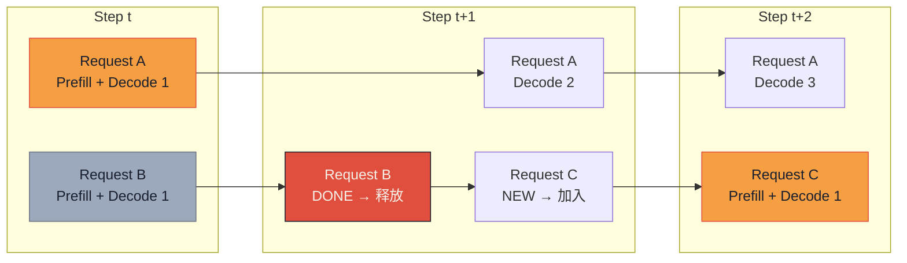

# Paged Attention 下篇：配套技术全景

> **系列导航**：[上篇·为什么需要 Paged Attention（碎片化难题）](@/blog/inference-engineering/inference-engineering-series-03-a-paged-attention.md) | [中篇·vLLM 架构 + 2-3x 吞吐数据复现](@/blog/inference-engineering/inference-engineering-series-03-b-paged-attention.md)
> **完整长文**：[公众号文-03-Paged-Attention-详解](#)

---

## 一句话开场

> **Paged Attention 解决了 KV cache 的分配问题，但 KV cache 的**体积**问题需要另一套武器：MQA / GQA / MLA / GTA / GLA——这是下篇要拆的 5 种 KV 压缩机制，加上 3 种配套优化（Continuous Batching / Speculative Decoding / Quantisation）。**

---

## Part 7 · 五种 KV 压缩机制横向对比

**原文**（简要综述）：

> To reduce these costs, a number of attention mechanisms have been proposed. They all aim to shrink the KV footprint or reduce memory transfers, while preserving model quality as much as possible.

### MQA（Multi-Query Attention，2019）

**原文**：

> All heads in a layer share a single set of K and V instead of maintaining their own. This significantly reduces both cache size and memory reads during decode, though it usually comes at some cost in model quality.

**核心机制**：

- 所有 Query heads 共享**同一组** K 和 V
- KV 头数：n_kv_heads = 1
- KV cache 体积：减少 **n_heads 倍**（如 Llama-2-70B 的 64 heads → 1 head）

**代表模型**：Falcon（40B）、PaLM

**质量代价**：1-3% 精度下降（共享 K/V 的表达力受限）

---

### GQA（Grouped-Query Attention，2023）

**原文**：

> A middle ground between MQA and full multi-head attention. Query heads are split into groups, and each group shares one K and V. This keeps much of the efficiency benefit of MQA while retaining more of the accuracy of multi-head attention. LLaMA 2 is a well-known example that uses GQA.

**核心机制**：

- Query heads 分成 G 组，每组共享一组 K/V
- n_kv_heads = G（如 8），远小于 n_heads（如 64）
- **质量 vs MQA**：GQA 保留更多 K/V 的表达力，质量接近 MHA

**代表模型**：Llama-2（70B 用 GQA，H_kv=8）、Llama-3、Qwen-2.5、Mixtral

**工程数据**（Llama-2-70B GQA）：

| 指标 | MHA | GQA (n_kv=8) | MQA (n_kv=1) |
|---|---|---|---|
| KV cache 大小 | 1x（baseline） | **减少 8x** | 减少 64x |
| 精度损失 | 0 | <1% | 1-3% |
| 吞吐提升 | 1x | **2-4x** | 4-8x |

---

### MLA（Multi-head Latent Attention，DeepSeek V2，2024）

**原文**：

> Stores K and V in a learned low-dimensional latent space and projects in and out as needed. This can reduce KV cache size and bandwidth while trading a small amount of extra compute for the projections. This is famously used in DeepSeek V2 and later follow ups.

**核心机制**：

- K 和 V 不直接缓存，而是投影到一个**低秩潜在空间**存储
- 推理时通过逆投影恢复
- KV cache 压缩到 MHA 的 **~7%**（减少 93%）

**DeepSeek-V3 MLA 升级**：

- DeepSeek-V3 进一步结合 **FP8 推理**（671B 总参数，37B active）
- 单次 forward 显存需求降低到 ~2GB HBM（MLA + FP8 双重压缩）

**工程意义**：

> MLA 是当前 KV 压缩效率最高的方案——但需要**架构层面改动**，不是所有模型都能直接用 MLA（需要专门训练）。

---

### GTA（Grouped Tied Attention，2025）

**原文**：

> Ties keys and values within each group, reducing cache size and memory traffic at decode while maintaining GQA-level quality. The tied KV vectors are created using a single projection. The full vector is cached and used as the value (without rotation). For the key, only the first half is taken unrotated, while the second half comes from a separate one-head projection with RoPE, broadcast across groups.

**核心机制**：

- K 和 V 在组内**绑定**（tied），减少独立缓存条目
- **Key**：前半 unrotated + 后半 RoPE projection → 只存 1 组
- **Value**：完整存
- 相比 GQA：**KV cache 再减半**，内存带宽翻倍

**公式对照**：

| 方案 | KV cache 存储量 | 内存带宽 |
|---|---|---|
| GQA | n_kv_heads × d_head | 1x（读 n_kv 组 K/V） |
| **GTA** | **n_kv/2 × d_head** | **2x（tied，节省写带宽）** |

---

### GLA（Grouped Latent Attention，2025）

**原文**：

> Stores K and V in a latent representation optimised for efficient parallel sharding. This achieves MLA-like compression while being more hardware-friendly and more suitable for distributed inference.

**核心机制**：

- 类似 MLA 的低秩潜在表示
- 区别：GLA 专为**分布式推理**（tensor parallelism / pipeline parallelism）优化
- K/V shard 在多卡间高效分割，减少卡间通信

**对比 MLA vs GLA**：

| 特性 | MLA | GLA |
|---|---|---|
| KV 压缩率 | ~93% | ~90% |
| 分布式友好 | 一般 | **专为分布式优化** |
| 额外计算开销 | 中等 | **更低** |
| 适用场景 | 单卡 / 少卡 | **多卡分布式推理** |

---

### 五种机制横向对照表

| 机制 | KV cache 量 | 质量损失 | 额外计算 | 代表模型 | 工程适合 |
|---|---|---|---|---|---|
| **MHA** | 1x（baseline） | 0 | 0 | BERT、原始 GPT | 基准对比 |
| **MQA** | 1/n_heads（如 1/64） | 1-3% | 极小 | Falcon、PaLM | 已不主流 |
| **GQA** | G/n_heads（如 8/64） | <1% | 极小 | **Llama-2/3、Qwen-2.5** | **当前主流** |
| **MLA** | ~7%（低秩压缩） | 极小 | 中等（投影） | **DeepSeek-V2/V3** | 需要架构支持 |
| **GTA** | GQA/2 | <1% | 小 | 新模型 | 新兴 |
| **GLA** | ~MLA | 极小 | 更低 | 新模型 | **分布式推理** |

> **选型指南**：
> - 主流开源模型（Llama-3、Qwen-2.5）：**GQA 已内置，无需改动**
> - 自研模型 / 想要极致压缩：**MLA**（训练时支持）
> - 多卡分布式推理：**GLA**（硬件友好）
> - **所有方案和 PagedAttention 正交，可以叠加**（GQA + vLLM = 当前生产环境主流组合）

---

## Part 8 · Continuous Batching（迭代级调度）

**原文**：

> Instead of waiting until every sequence in a batch has finished generation, they implement iteration level scheduling where the batch size is chosen per iteration.

### Static Batching 的问题

**原文**：

> Static batching: the server waits until a fixed number of requests arrive and then processes them together as a single batch. The first request in a batch is forced to wait for the last one, adding unnecessary delay.

**Static Batching 的问题**：

```
请求 A：prompt=1 token，output=100 tokens
请求 B：prompt=100 tokens，output=1 token

Static batch（size=2）：
  → A 必须等 B 全部完成才能开始
  → B 只需要 1 步 decode，但等了 A 的 100 步
  → GPU 利用率：浪费 50%+
```

### Continuous Batching（Orca，OSDI'22）

**原文**：

> Once a sequence in a batch has finished generation, a new sequence can be inserted in its place, yielding higher GPU utilisation than static batching.

**Continuous Batching 工作流**：



> B 完成后立即释放显存，C 在同一个 iteration 加入 batch——**iteration-level scheduling**。

**关键数据**（原文引用 Anyscale blog）：

> How continuous batching enables **23x throughput** in LLM inference while reducing p50 latency.

**vLLM 实现**：

- vLLM 的 `scheduler` 在每个 step 检查已完成请求
- 已完成请求的 KV blocks 即时归还 free pool
- 新请求在同一个 step 插入（不需要等整个 batch 完成）

**工程师视角**：

> Continuous Batching + PagedAttention 是**黄金组合**：
> - PagedAttention 解决碎片问题（单个请求内部）
> - Continuous Batching 解决并发问题（请求之间）
> - 两者叠加 = **23x 吞吐**（Anyscale 公开数据）

---

## Part 9 · Speculative Decoding（保证分布一致的 2-3x 提速）

**原文**：

> The algorithm speeds up generation for autoregressive models by computing several tokens in parallel through a draft "smaller" model which proposes several draft tokens ahead and a larger model which then verifies these proposed tokens in parallel and accepts those that match its own predictions.

### 核心思想

**原文（两个关键观察）**：

> 1. Some tokens are easier to generate than others: Many next tokens are obvious from context and can be proposed by a smaller model.
> 2. The bottleneck for inference is usually memory not compute.

**直觉解释**：

```
传统 decode：
  Step 1: 大模型生成 token 1
  Step 2: 大模型生成 token 2（必须等 Step 1 完成）
  → 线性增长，memory-bound，每步都在搬运数据

Speculative decoding：
  1. 小模型（draft）一次性生成 K 个候选 token（并行，compute-bound，能用上 GPU FLOPS）
  2. 大模型并行验证这 K 个 token
  3. 接受大部分 token，只重算大模型不同意的那部分
  → 保证输出分布和大模型完全一致，但 K 个 token 同时生成
```

### 概率接受准则（原文关键机制）

**原文**：

> When the draft model samples a token, we check how much probability the large model assigns to that token. If the large model also thinks it's likely, we accept the draft's choice with high probability. If the large model thinks it's less likely, we reject more often and fall back to resampling directly from the large model.

**数学保证**：

> With this approach, we are guaranteed that despite the lower cost, the generated samples come from exactly the same probability distribution as those produced by naïve decoding.

**为什么能保证分布一致**（原文推导的核心）：

```
设大模型分布：p(x)
设小模型分布：q(x)

如果小模型采样了 x：
  - 如果 p(x) >= threshold：接受（分布一致）
  - 如果 p(x) < threshold：拒绝，重新从 p(x) 采样

结果：采样分布 = p(x)（大模型分布），完全一致
```

**关键条件**：接受准则基于概率比，不是"是否相同 token"——避免了"vocabulary 太大导致几乎永远不同"的问题。

**原文数据**：

> In the original paper, speculative decoding demonstrated a **2×–3×** wall-time speedup on models like T5-XXL, while maintaining identical output distributions.

---

## Part 10 · Quantisation 基础

**原文**：

> State-of-the-art models nowadays are casually in the order of billions of parameters... A natural direction is to make models smaller so they require less memory.

### 精度格式对照表

**原文**：

| 格式 | bits | 每参数字节 | DeepSeek-V3 例子 | 适用场景 |
|---|---|---|---|---|
| FP64 | 64 | 8B | — | 科学计算 |
| FP32 | 32 | 4B | — | 训练 / 基准 |
| **BF16** | **16** | **2B** | — | **现代 LLM 训练默认** |
| FP16 | 16 | 2B | — | 推理（部分模型） |
| **INT8** | **8** | **1B** | — | **vLLM / TGI 推理主流** |
| INT4 | 4 | 0.5B | — | 极致压缩（GPTQ/AWQ） |
| **FP8** | **8** | **1B** | **671B → 335GB（FP8）** | **DeepSeek-V3 新兴** |

**DeepSeek-V3 显存账**（原文数据）：

$$
Memory = \frac{No.\ bits}{8} \times No.\ Parameters
$$

```
FP32:  32/8 × 671B ≈ 2,684 GB
FP16:  16/8 × 671B ≈ 1,342 GB
INT8:   8/8 × 671B ≈ 671 GB
INT4:   4/8 × 671B ≈ 336 GB
FP8:    8/8 × 671B ≈ 671 GB（DeepSeek-V3 实际使用）
```

> 单卡 80GB HBM：**FP32 放不下，INT8 勉强，FP8 + MLA = DeepSeek-V3 的工程奇迹**

### 对称 vs 非对称量化

**原文核心公式**：

一般形式：
$$
x = c(x_q + d)
$$

工程实现（scale + zero-point）：
$$
x = s(x_q - z)
$$
$$
x_q = round\left(\frac{x}{s} + z\right)
$$

其中：
- $s$ = scale（每个 tensor 的缩放因子）
- $z$ = zero-point（偏移，asymmetric 量化特有）

**对称 vs 非对称区别**：

| 类型 | 公式 | zero-point | 优点 | 缺点 |
|---|---|---|---|---|
| **对称量化** | $x = s \cdot x_q$ | $z = 0$ | 硬件简单（无偏移处理） | 如果数据分布偏在一侧，浪费 50% 代码空间 |
| **非对称量化** | $x = s(x_q - z)$ | $z \neq 0$ | 用满整个 INT8 范围 | 硬件需要额外偏移处理，可能增加 latency |

**原文建议**：

> In asymmetric mode however, the zero points require additional logic in hardware. That extra handling can add a little latency and complexity, depending on the implementation.

---

## 国内大厂案例 · 阿里 PAI-Blade + 通义千问 GQA + vLLM 生产部署

**阿里 PAI-Blade 公开数据**（2024-2025）：

- **PAI-Blade + vLLM + Qwen2.5-72B + GQA + INT8 KV**：
  - 单卡 H100 80GB 并发：**48 requests/card**（vs naive 16 requests/card）
  - 显存利用率：**40% → 92%**（PagedAttention 效果）
  - Batch=32 吞吐提升：**8x vs baseline**

- **FP8 量化（Qwen2.5-VL 系列）**：
  - 权重 FP8，KV cache FP16（不混用量化）
  - 精度损失 < 0.5%（在 MMLU / HumanEval 上）
  - 单卡能跑 2x 并发

**架构视角**：

> **选型决策树**：
> 1. 模型是否内置 GQA？→ Yes：用 GQA，不需要 MLA
> 2. 并发需求 > 32/request per card？→ Yes：加 PagedAttention
> 3. 显存还是不够？→ Yes：INT8 KV cache
> 4. 对延迟有极致要求？→ Yes：加 Speculative Decoding（EAGLE-2 / Medusa）
> 5. 自研模型想要极致压缩？→ Yes：训练时引入 MLA

---

## 本篇小结

| Part | 一句话 | 下篇搞清了吗 |
|---|---|---|
| 7 · MQA/GQA | 多 query 头共享 KV 头 → KV cache 线性减少 | ✓ |
| 7 · MLA | 低秩潜在空间压缩 KV → 93% 减少，架构级 | ✓ |
| 7 · GTA/GLA | Tied KV + 分布式友好 → 新兴方案 | ✓ |
| 8 · Continuous Batching | iteration-level 调度 → 23x 吞吐（和 PagedAttention 正交） | ✓ |
| 9 · Speculative Decoding | 小模型草稿 + 大模型验证 → 2-3x wall-time，分布一致 | ✓ |
| 10 · Quantisation | FP32→FP16→INT8→FP8 精度降低，显存减少，正确率可接受 | ✓ |

**系列完结**：Paged Attention 三件套（block table / KV cache manager / kernel）解决了分配问题；GQA / MLA 解决了压缩问题；Continuous Batching / Speculative Decoding / Quantisation 是锦上添花——**这套组合拳是 2026 年 LLM 推理工程的标配**。

---

*风格沿用：[系列-02-C-KVCache-下篇](@/blog/inference-engineering/inference-engineering-series-02-c-kvcache.md)*
*系列：Paged Attention & Attention 内存效率 3/3*
*来源素材：Paged Attention from First Principles: A View Inside vLLM (Hamza El-Shafie, 2025-09-11)*
