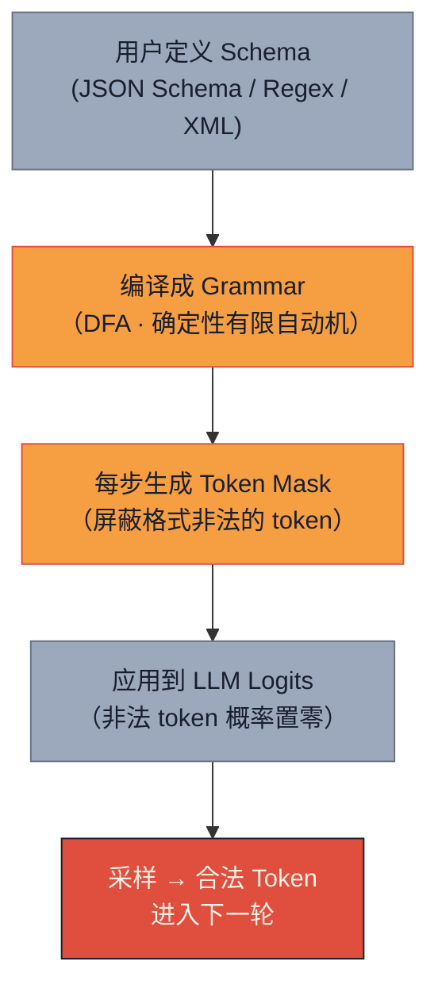
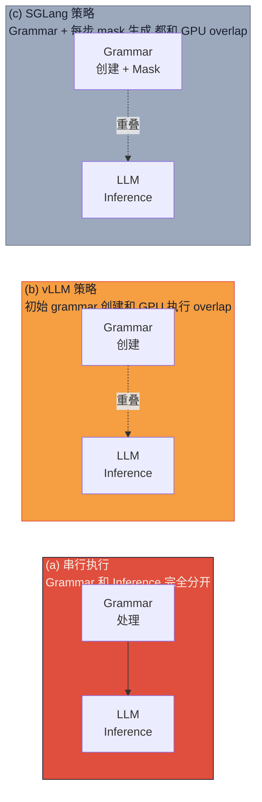

# 为什么你的 Agent 总返回畸形 JSON：Guided Decoding 是什么（上篇）

> **系列导航**：[中篇·2×2 Benchmark 全图](@/blog/inference-engineering/inference-engineering-series-04-b-guided-decoding.md) | [下篇·选型决策表 + 国内案例](@/blog/inference-engineering/inference-engineering-series-04-c-guided-decoding.md)
> **完整长文**：[公众号文-04-Guided-Decoding-详解](#)

---

## 一句话开场

> **你写了一个 Agent：用户问"北京今天天气"，模型调用 `get_weather(city="Beijing")`——结果它返回了 `{"tool": "get_weather", "args": }` 加一句"下面是调用结果"然后开始聊天。**
> **——这不是模型幻觉，这是 serving 层没有对输出结构做约束。Guided Decoding 就是这个约束的工程实现。**

本篇（上）讲**为什么 Agent 需要结构化输出 + guided decoding 工作流 + 两类 grammar backend 的核心哲学**。

---

## Part 1 · 为什么 Agent 必须输出结构化数据

LLM 天然是**概率生成器**——给定 prompt，它输出下一个 token、再下一个，文本流畅但**格式随意**。

这对两类场景是致命问题：

### 1.1 Tool-call / Function Call：机器要读懂

当 LLM 充当 Agent 的大脑时，它的输出不是给人看的——是**给下游系统读的**。

一个典型的 tool-call 场景：

```
用户：帮我查一下北京今天天气

期望输出（给工具链）：
{
  "tool": "get_weather",
  "args": {"city": "北京", "unit": "celsius"}
}

实际输出（没有 guided decoding）：
让我帮你查一下北京天气...（后面跟一段自然语言解释）
或者：
{"tool": "get_weather", "args": }  ← 中途截断，JSON 不完整
```

**没有约束时，LLM 可能会：**
- 在 JSON 前面加一段"解释性文字"
- 在 JSON 后面加闲聊
- 生成的 JSON 字段名不符合 schema
- 生成的 JSON 写到一半就截断（max_tokens 不够）
- 生成 `null` 而不是合法的 enum 值

这意味着**下游工具调用 100% 失败**——你的 Agent 每次都 crash 在 JSON 解析上。

### 1.2 数据提取：需要稳定 schema

从非结构化文本中提取结构化数据（简历解析、发票识别、医疗报告标准化）：

```
输入：一段自然语言描述
期望输出：
{
  "name": "张三",
  "age": 35,
  "skills": ["Python", "Kubernetes", "PostgreSQL"]
}

没有 guided decoding 时的输出：
张三，35岁，精通 Python、Kubernetes...
```

**核心问题**：LLM 不知道自己"只能输出 JSON"，它只是在续写——而续写可能超出 JSON 范围。

### 1.3 真实数据：不用 guided decoding 正确率低得吓人

原文 benchmark 数据（GitHub_medium 复杂 schema 场景）：

| 条件 | 正确率（输出符合 schema） |
|---|---|
| 无 guided decoding | **61.1%** |
| 有 guided decoding | **86.1%** |

**不用 guided decoding，你的 Agent 在复杂 schema 下有近 40% 的概率返回不可用的输出。**

> **国内大厂案例 · DeepSeek Function Call**

DeepSeek 在其 Function Call 场景中严格要求输出**严格 JSON 格式**，不允许任何自然语言前缀或后缀。DeepSeek-V2 API 的 tool-use 实现背后依赖 guided decoding 确保每次调用都生成格式正确的 JSON——否则下游的工具调度系统会直接崩溃。据公开技术文档，DeepSeek 在内部评测中要求 Function Call 正确率 > 99%，这个量级不用 grammar constraint 几乎不可能达到。

---

## Part 2 · Guided Decoding 工作流：DFA → Token Mask → Logits

**Guided Decoding**（也称 structured output / constrained decoding）通过限制每个生成步骤的 token 候选集合，让模型只从"格式合法的 token"中采样。

核心工作流分三步：



**三步详解**：

**Step 1：Schema 编译成 Grammar（DFA）**

用户定义的 schema（JSON Schema、regex、XML DTD）被编译成一个**确定性有限自动机（DFA）**。

DFA 的每一个状态代表"当前语法允许的 token 集合"——例如：
- `{"key": "` 状态 → 下一个合法 token 是字符串
- `"key": "` 状态 → 下一个合法 token 是冒号
- `"key": "` 后 → 下一个合法 token 是值类型（string / number / boolean / object / array）

**Step 2：每步生成 Token Mask**

在每个生成步骤，DFA 根据当前已生成的 token 序列更新状态，然后**生成一个 bitmask**——vocabulary 中每个 token 一个 bit，合法为 1、非法为 0。

这就是**计算开销的来源**：每步都要跑一遍 DFA 状态转换 + mask 生成。

**Step 3：Logits 屏蔽**

将 mask 作用到 LLM 的输出 logits 上：

$$
p_{\text{constrained}}(t) = \begin{cases}
\frac{\exp(logit_t)}{\sum_{t' \in \text{mask}} \exp(logit_{t'})} & \text{if } t \in \text{valid} \\
0 & \text{otherwise}
\end{cases}
$$

采样只能在合法 token 集合中进行——保证输出格式 100% 正确。

---

## Part 3 · 两类 Grammar Backend 哲学对比

Guided decoding 的性能瓶颈不在 GPU——**而在 CPU 端的 mask 生成**。XGrammar 和 LLGuidance 用两种完全不同的策略解决这个问题。

### 3.1 XGrammar：预计算 + 缓存

**核心思想**：把 mask 分成两类，在**编译阶段就尽可能多地算完**。

```
vocabulary token 分类：
├── context-independent（上下文无关）
│   → 无论 DFA 处于什么状态，这些 token 都"永远合法/永远非法"
│   → 编译时直接固定 mask，不会在运行时改变
│   └── 示例：JSON 中 `"name": "` 后，下一个合法 token 集合是固定的
│
└── context-dependent（上下文相关）
    → DFA 状态不同，合法性就不同
    → 需要在每步 decode 时动态判断
    └── 示例：在一个 `enum: ["A", "B"]` 的当前值是 "A" 时，
        "A" 已耗尽，下一个合法 token 变成只有 "}"
```

**XGrammar 的优势**：
- schema **重复使用时**极快——grammar 被缓存，context-independent mask 直接复用
- 简单 schema 下，context-dependent token 集合很小，每步 mask 生成几乎免费

**XGrammar 的劣势**：
- 预计算本身有开销——schema 第一次见时，编译时间不可忽视
- 复杂 schema（context-dependent token 多）下，大量 mask 还是要运行时生成，退化为"慢"

### 3.2 LLGuidance：懒编译 + 动态 Mask

**核心思想**：不预计算，把 vocabulary 组织成**前缀树（trie）**，每步只查 trie 生成 mask。

```
LLGuidance 的 Trie 结构：
                           root
                    ┌──────┼──────┐
                    "     {     [
                 ┌──┴──┐  ...   ...
               name  age  ...
              ┌─┴──┐
            :   ,  ...

每个 decode 步骤：根据当前 DFA 状态，从 trie 中找出所有"当前合法 token 前缀"，
生成 mask 时只需要遍历 trie 的相关分支
```

**LLGuidance 的优势**：
- **第一次见复杂 schema 时也很快**——不需要预计算，直接动态生成
- 灵活：任何新 schema 都能立刻处理，没有"编译负担"

**LLGuidance 的劣势**：
- 每步都要遍历 trie——简单重复 schema 下反而比 XGrammar 慢
- 因为没有缓存机制，重复 schema 下也有相同开销

### 3.3 核心对比

| 维度 | XGrammar | LLGuidance |
|---|---|---|
| **策略** | 预计算 + 缓存 | 懒编译 + 动态 mask |
| **vocabulary 处理** | 分 context-independent / dependent | vocabulary trie |
| **首次见 schema** | 慢（预计算开销） | 快（直接动态生成） |
| **重复 schema（相同 schema 多请求）** | **极快** | 慢（无缓存优势） |
| **动态 schema（每个请求不同）** | 慢（缓存失效） | **快** |
| **适合场景** | 批量表单填充、重复 tool-call | 实时提取、多变的 API 响应 |
| **版本** | xgrammar 0.1.21 | llguidance 0.7.30 |

---

## Part 4 · Serving Framework：谁在决定上限

Grammar backend 只是拼图的一半。另一半是 **serving framework 如何集成 grammar 处理**——这才是决定性能上限的关键。

### 4.1 三种集成方式



**(a) 串行执行（最 naive）**：grammar 处理完成后才启动 GPU inference——完全无 overlap，CPU 等待时间直接加到延迟上。

**(b) vLLM 策略**：初始 grammar 创建与 GPU 执行"重叠"——当 GPU 在做 prefill 时，CPU 在后台编译 grammar。但**每步 mask 生成**仍然是串行瓶颈。

**(c) SGLang 策略（最优）**：不仅 initial grammar 创建 overlap，连**每步的 token mask 生成**也和 GPU inference 重叠——CPU-bound 的 grammar 处理被完全隐藏在 GPU 计算背后。

> **关键洞察**：grammar 处理是 **CPU-intensive**，LLM inference 是 **GPU-intensive**——天然可以并行。SGLang 的设计哲学是"让 CPU 和 GPU 同时干活"，vLLM 只做了"让 initial grammar 创建 overlap"。

### 4.2 量化结论

原文 Book-Info 1000 请求（重复 schema）数据：

| Framework | TPOT（ms/token） | 备注 |
|---|---|---|
| vLLM baseline（无 guided decoding） | 15.2 | 正确率 ~72% |
| vLLM + XGrammar | 23.1 | 正确率 100% |
| SGLang baseline（无 guided decoding） | 14.8 | 正确率 ~72% |
| **SGLang + XGrammar** | **16.5** | 正确率 100%，几乎无性能损失 |

**SGLang + XGrammar 在重复 schema 场景下，只比无约束慢 11%；vLLM + XGrammar 慢 52%。**

### 4.3 工程选型第一原则

> **如果你的场景需要结构化输出——优先选 SGLang，再选 grammar backend。**

Framework 选型比 grammar backend 选型对最终性能的影响更大（SGLang 的 overlap 机制是结构性的，不是微优化）。

---

## Part 5 · 国内大厂案例：通义千问 Agent tool-use 的坑

> **通义千问（Qwen）** 在 Agent 场景中广泛使用 function call / tool-use。其开源 Agent 框架（基于 LangChain 的修改版）在 2024 年被社区大量反馈的一个典型问题是：**输出的 JSON 前面经常带一段自然语言解释**，导致 `json.loads()` 失败。

**问题根因**：

早期 Qwen 模型没有强制 guided decoding，模型在 tool-call JSON 前后都会生成解释性文字——"根据您的要求，我帮您调用天气接口..."。

**社区 workaround**：

```python
# 暴力提取 JSON 的 workaround（不稳定）
import re, json

def extract_json(text: str) -> dict:
    # 找第一个 { 和最后一个 } 之间的内容
    match = re.search(r'\{.*\}', text, re.DOTALL)
    if match:
        return json.loads(match.group())
    raise ValueError("No JSON found")
```

**正确解法**：在 serving 层开启 guided decoding，用 JSON Schema 约束输出——这才是一劳永逸的解法。

---

## 工程师笔记 · 三栏视角

| 维度 | 要点 |
|---|---|
| **后端** | guided decoding 在 CPU 端生成 mask，必然和 GPU inference 竞争资源；选 SGLang 让这种竞争变成 overlap |
| **Ops** | 测正确率：你的 Agent 在目标 schema 下"无 guided decoding 正确率"到底是多少？低于 90% 就必须上 guided decoding |
| **架构** | Tool-call Agent 的可靠性由最弱一环决定——模型输出格式；如果格式无法保证，整个 Agent 系统不可信 |

---

## 本篇小结 + 下篇预告

| Part | 一句话 | 上篇搞清了吗 |
|---|---|---|
| 1 · 为什么需要结构化输出 | Agent 输出不是给人看，是给机器读——无约束时正确率可低至 61% | ✓ |
| 2 · Guided Decoding 工作流 | Schema → DFA → Token Mask → Logits 屏蔽，三步保证格式合法 | ✓ |
| 3 · 两类 grammar backend 哲学 | XGrammar = 预计算缓存（重复 schema 快）/ LLGuidance = 懒编译动态（动态 schema 快） | ✓ |
| 4 · Serving framework 决定上限 | SGLang overlap 机制结构性优于 vLLM | ✓ |

**下篇预告（中）**：**2×2 Benchmark 全图**——Book-Info（重复 schema）/ GitHub_easy / GitHub_medium（动态 schema）三场景下 XGrammar × LLGuidance × vLLM × SGLang 的具体吞吐、TPOT、correct rate 数据复现。

**互动**：你的团队现在有做结构化输出的约束吗？是怎么处理的——在 prompt 里加"只输出 JSON"、正则后处理、还是已经在 serving 层做了 guided decoding？

---

*本系列来源：SqueezeBits Blog · Guided Decoding Performance on vLLM and SGLang (https://blog.squeezebits.com/guided-decoding-performance-vllm-sglang) · 2025-09-16 · Eunik Park*
*风格沿用：[系列-02-A-KVCache-上篇](@/blog/inference-engineering/inference-engineering-series-02-a-kvcache.md) · Why + What 叙事结构*
*系列 1/3 · Guided Decoding 原理篇*
