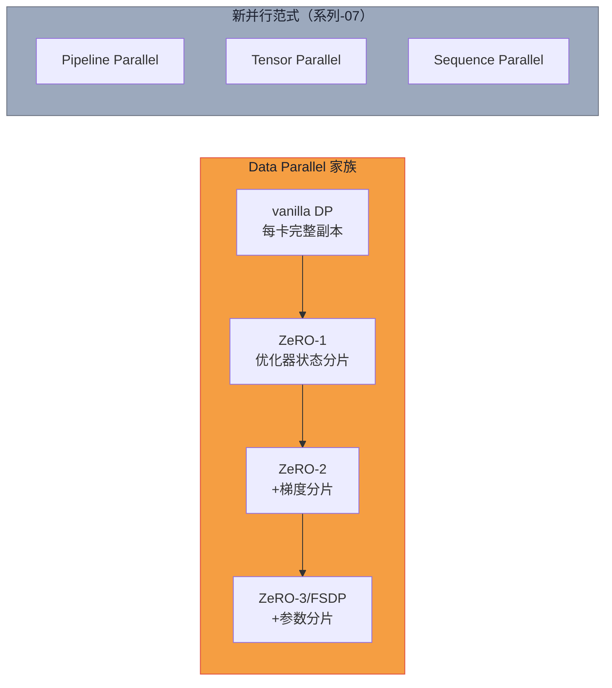

# 系列-05 · Distributed Training · 从单卡到集群（中篇）：Data Parallel 与 ZeRO-1/2/3 全图

> **系列导航**：[上篇·单卡账本 + 省钱三件套](@/blog/inference-engineering/inference-engineering-series-05-a-distributed-training.md) | [下篇·Ray Train 实战](@/blog/inference-engineering/inference-engineering-series-05-c-distributed-training.md)
> **完整长文**：[公众号文-05-Distributed-Training-详解.md](#)

---

## 一句话承上启下

> **上篇的三件套能省钱，但不能把 70B 塞进单卡。**
> 当模型本身（而非 batch）就已经装不下时，必须把**模型本身**分布到多张卡上。
> 这一篇讲清楚：Data Parallel 的本质 / 三个通信原语（All-Reduce / All-Gather / Reduce-Scatter）/ ZeRO-1/2/3 的递进逻辑和显存公式 / ZeRO-3 与 FSDP 的关系。

---

## Part 1 · Data Parallel 的本质

### 1.1 什么是 DP

Data Parallel（DP）：**每张卡存一份完整模型**，各自跑不同的 micro-batch，最后用 All-Reduce 同步梯度。

```
┌──────────┐   ┌──────────┐   ┌──────────┐   ┌──────────┐
│  GPU 0   │   │  GPU 1   │   │  GPU 2   │   │  GPU 3   │
│ Model(Ψ) │   │ Model(Ψ) │   │ Model(Ψ) │   │ Model(Ψ) │
│ micro-bs=1│   │ micro-bs=2│   │ micro-bs=3│   │ micro-bs=4│
│ ↓ fwd     │   │ ↓ fwd    │   │ ↓ fwd    │   │ ↓ fwd    │
│ ↓ bwd     │   │ ↓ bwd    │   │ ↓ bwd    │   │ ↓ bwd    │
│ ∇Φ_0     │   │ ∇Φ_1     │   │ ∇Φ_2     │   │ ∇Φ_3    │
│   ↓ All-Reduce (求和 → 全局梯度) ↓               │
│  Σ∇Φ_i = 全局梯度 → 每张卡收到相同结果           │
│   ↓ optimizer.step()（各自独立执行）               │
└──────────┘   └──────────┘   └──────────┘   └──────────┘
```

### 1.2 DP 的显存账：还是 16Ψ/卡

DP 下每张卡都存完整模型：

| 每卡占用 | 显存 |
|---|---|
| 模型参数（BF16） | $2\Psi$ |
| 参数梯度（BF16） | $2\Psi$ |
| Optimizer states（FP32×2） | $8\Psi$ |
| Master weights（FP32） | $4\Psi$ |
| **合计** | **$16\Psi$** |

**DP 的问题**：参数量 $\Psi$ 越大，每卡显存占用越大；$\Psi$ 超过单卡承载能力时，DP 直接失效。

### 1.3 DP 通信原语：All-Reduce

**All-Reduce**：N 张卡各有一个局部梯度 $\nabla\Phi_i$，做**全局求和**，结果**同步广播给所有卡**。

$$
\text{All-Reduce}(\nabla\Phi_0, \nabla\Phi_1, \ldots, \nabla\Phi_{N-1}) = \sum_{i=0}^{N-1}\nabla\Phi_i \quad \text{on every rank}
$$

```python
# torch.distributed All-Reduce 示例
import torch
import torch.distributed as dist

dist.init_process_group(backend='nccl')
tensor = torch.tensor([dist.get_rank() + 1] * 3, dtype=torch.float32).cuda()
dist.all_reduce(tensor, op=dist.ReduceOp.SUM)
# 4 卡: [1,1,1]+[2,2,2]+[3,3,3]+[4,4,4] = [10,10,10] on all ranks
```

**DP 通信时间线**：

```mermaid
gantt
    title DP 通信时间线（Backward 阶段）
    dateFormat X
    axisFormat %s ms

    section GPU 0
    Fwd pass        :done, fwd0, 0, 50
    Bwd compute     :active, bwd0, 50, 100
    All-Reduce      :wait, ar0, 100, 150

    section GPU 1
    Fwd pass        :done, fwd1, 0, 50
    Bwd compute     :active, bwd1, 50, 100
    All-Reduce      :wait, ar1, 100, 150

    section GPU 2
    Fwd pass        :done, fwd2, 0, 50
    Bwd compute     :active, bwd2, 50, 100
    All-Reduce      :wait, ar2, 100, 150

    section GPU 3
    Fwd pass        :done, fwd3, 0, 50
    Bwd compute     :active, bwd3, 50, 100
    All-Reduce      :wait, ar3, 100, 150
```

> **优化：通信与计算重叠（Hook + Bucketing）**——PyTorch 的 `post_accumulate_grad_hook` 可以在每个梯度算完后立即触发 All-Reduce，而不是等全部算完再同步。

### 1.4 DP 的局限

| 问题 | 表现 |
|---|---|
| 显存墙 | 参数量 > 单卡容量时直接崩溃 |
| GPU 利用率墙 | 随 GPU 数量增加，throughput 退化（通信瓶颈） |
| 扩展效率 | > 8 卡后边际收益急剧下降 |

**当模型 70B，A100 80GB 装不下时——必须分片。**

---

## Part 2 · ZeRO 家族：三阶段递进

> **核心思想**：把 DP 里每张卡的"完整副本"拆开（shard），不同组件分到不同卡——**都是 DP 的变种，不是新的并行范式**。

### 2.0 三通信原语对照表

| 原语 | 输入 | 操作 | 输出 |
|---|---|---|---|
| **All-Reduce** | 各卡局部梯度 $\nabla\Phi_i$ | 全局求和 | **所有卡**收到相同总和 $\sum_i\nabla\Phi_i$ |
| **All-Gather** | 各卡局部参数分片 $P_i$ | 收集所有 | **所有卡**收到完整参数 $P_0 \cup P_1 \cup \ldots$ |
| **Reduce-Scatter** | 各卡局部梯度 $\nabla\Phi_i$ | 求和后**分片** | 每卡只收到自己对应分片的**聚合结果** |

```python
# All-Gather 示例
gathered = [torch.zeros_like(tensor) for _ in range(world_size)]
dist.all_gather(gathered, tensor)
# 4 卡: rank0=[1,1,1] → all ranks get [[1,1,1],[2,2,2],[3,3,3],[4,4,4]]

# Reduce-Scatter 示例
output = torch.zeros(3, dtype=torch.float32).cuda()
dist.reduce_scatter(output, input_list, op=dist.ReduceOp.SUM)
# 4 卡: each rank gets sum of corresponding chunk across all ranks
```

### 2.1 ZeRO-1：分片 Optimizer States + Master Weights

**做法**：把 $8\Psi$（Adam states）+ $4\Psi$（FP32 master weights）切分到 N 张卡，每卡只存 $\frac{12\Psi}{N}$。

| 组件 | DP 每卡 | ZeRO-1 每卡 |
|---|---|---|
| 参数（BF16） | $2\Psi$ | $2\Psi$ |
| 梯度（BF16） | $2\Psi$ | $2\Psi$ |
| Optimizer states（Adam, FP32） | $8\Psi$ | $\frac{8\Psi}{N}$ |
| Master weights（FP32） | $4\Psi$ | $\frac{4\Psi}{N}$ |
| **合计** | $16\Psi$ | $2\Psi + 2\Psi + \frac{12\Psi}{N} = 4\Psi + \frac{12\Psi}{N}$ |

$$
M_{\text{ZeRO-1}} = 4\Psi + \frac{12\Psi}{N_d}
$$

**通信代价**：bwd 后做一次 Reduce-Scatter（聚合梯度） + optimizer step 后做一次 All-Gather（同步更新后的完整参数）= $2\Psi$ 总通信量。

**80GB A100 + 64 卡 = 可训 19B**（DP 仅 5B）：

$$
\frac{80\text{ GB}}{4.2\text{ bytes/param}} \approx 19\text{ B params}
$$

### 2.2 ZeRO-2：ZeRO-1 + 分片 Gradients

**新增**：梯度也在 N 张卡间分片，每卡只存 $\frac{2\Psi}{N}$。

| 组件 | DP 每卡 | ZeRO-1 每卡 | ZeRO-2 每卡 |
|---|---|---|---|
| 参数（BF16） | $2\Psi$ | $2\Psi$ | $2\Psi$ |
| 梯度（BF16） | $2\Psi$ | $2\Psi$ | $\frac{2\Psi}{N}$ |
| Optimizer states（FP32） | $8\Psi$ | $\frac{8\Psi}{N}$ | $\frac{8\Psi}{N}$ |
| Master weights（FP32） | $4\Psi$ | $\frac{4\Psi}{N}$ | $\frac{4\Psi}{N}$ |
| **合计** | $16\Psi$ | $4\Psi + \frac{12\Psi}{N}$ | $2\Psi + \frac{14\Psi}{N}$ |

$$
M_{\text{ZeRO-2}} = 2\Psi + \frac{14\Psi}{N_d} \approx 2.2\Psi \quad (N_d=64)
$$

**通信代价**：bwd 后直接 Reduce-Scatter（无需 All-Reduce） + All-Gather（参数更新后同步）= 同样 $2\Psi$。

**80GB A100 + 64 卡 = 可训 36B**：

$$
\frac{80\text{ GB}}{2.2\text{ bytes/param}} \approx 36\text{ B params}
$$

### 2.3 ZeRO-3：全量分片（参数 + 梯度 + Optimizer States）

**终极形态**：把参数、梯度、optimizer states 全部切分，每卡只存 $\frac{1}{N}$。

| 组件 | DP 每卡 | ZeRO-3 每卡 |
|---|---|---|
| 参数（BF16） | $2\Psi$ | $\frac{2\Psi}{N}$ |
| 梯度（BF16） | $2\Psi$ | $\frac{2\Psi}{N}$ |
| Optimizer states + Master weights | $12\Psi$ | $\frac{12\Psi}{N}$ |
| **合计** | $16\Psi$ | $\frac{16\Psi}{N}$ |

$$
M_{\text{ZeRO-3}} = \frac{16\Psi}{N_d} \approx 0.25\Psi \quad (N_d=64)
$$

**通信代价**：fwd 需要 All-Gather（取完整参数） + bwd 需要 All-Gather（再取一次）+ Reduce-Scatter（写回梯度分片）= **$3\Psi$ 总通信量**。

> **Prefetch 隐藏通信**：Layer n forward 的同时后台取 Layer n+1 的参数——只要 DP $\leq 512$，通信可以被计算完全覆盖。

**80GB A100 + 64 卡 = 可训 320B**：

$$
\frac{80\text{ GB}}{0.25\text{ bytes/param}} \approx 320\text{ B params}
$$

### 2.4 ZeRO-1/2/3 全量对比表

| 方案 | 每参数字节数 | 80GB 卡可训模型 | 通信量/iter | 通信可隐藏？ |
|---|---|---|---|---|
| **DP** | 16 bytes/param | ~5B | $2\Psi$（All-Reduce） | 部分（Hook） |
| **ZeRO-1** | 4.2 bytes/param | ~19B | $2\Psi$（RS+AG） | 部分 |
| **ZeRO-2** | 2.2 bytes/param | ~36B | $2\Psi$（RS+AG） | 部分 |
| **ZeRO-3 / FSDP** | 0.25 bytes/param | ~320B | $3\Psi$（AG+AG+RS） | ✅ Prefetch 可藏 |

> **决策 5 注解**：Pipeline Parallel / Tensor Parallel / Sequence Parallel 是**不同的并行维度**，不属于 ZeRO 体系——留给系列-07 展开。

---

## Part 3 · ZeRO-3 与 FSDP 的关系

> **常见混淆**：ZeRO-3 和 FSDP 是同一个东西吗？

| | ZeRO-3 | FSDP |
|---|---|---|
| **提出者** | Microsoft DeepSpeed（论文 arXiv:1910.02054） | PyTorch 官方（原生实现） |
| **本质** | DeepSpeed 框架实现的 ZeRO Stage 3 | PyTorch 原生 `torch.distributed.fsdp` |
| **策略** | **ZeRO-3**：optimizer/gradient/parameter 全部切分 | **FSDP**（Fully Sharded Data Parallel）：ZeRO-3 的 PyTorch 版本 |
| **接口** | DeepSpeed API | `prepare_model(parallel_strategy="fsdp")` |

**结论**：**ZeRO-3 = FSDP 的概念基础，FSDP = ZeRO-3 的 PyTorch 原生实现**。两者内存优化策略完全相同，区别只在框架和 API。

```python
# DeepSpeed ZeRO-3
model, optimizer, _, _ = deepspeed.initialize(
    model=model, optimizer=optimizer, config=ds_config
)

# PyTorch FSDP（等效）
model = torch.distributed.fsdp.HalfPrecision()
model = ray.train.torch.prepare_model(model, parallel_strategy="fsdp")
```

---

## Part 4 · DP vs ZeRO 不是并列关系

> **重要澄清**：ZeRO-1/2/3 都是 Data Parallel 的优化，**不是独立的并行范式**。
> 每张卡仍然跑完整 forward + backward（DP 的核心），区别只是**模型状态如何存储**。



---

## Part 5 · 国内大厂案例

### 5.1 字节 BytePS 分布式训练通信优化

字节跳动 ML Infra 团队在 2023 年公开的 BytePS 系统：
- 在 ZeRO-2 基础上增加了 **gradient fusion + tensor pipeline**
- 通信调度器在多租户集群中显著降低了 All-Reduce 争用
- 公开数字：在 512 卡 A100 集群上训练 175B 模型，线性扩展效率 > 85%

### 5.2 华为 MindSpore 开源 ZeRO 实现

华为 MindSpore 框架在 2024 年发布了自研 ZeRO 实现：
- ZeRO-1/2/3 完整支持
- 配合 Ascend NPU（昇腾）使用
- 在国产算力生态中填补了 ZeRO 空白

---

## 本篇小结

| 阶段 | 显存/参数 | 可训模型（80GB） | 通信代价 | 本质 |
|---|---|---|---|---|
| DP | 16 bytes | ~5B | $2\Psi$ All-Reduce | 每卡完整副本 |
| ZeRO-1 | 4.2 bytes | ~19B | $2\Psi$ RS+AG | Optimizer 分片 |
| ZeRO-2 | 2.2 bytes | ~36B | $2\Psi$ RS+AG | +Gradient 分片 |
| ZeRO-3/FSDP | 0.25 bytes | ~320B | $3\Psi$ AG×2+RS | 全量分片 |

**下篇预告**：知道 ZeRO-3/FSDP 的原理后，下一篇讲怎么用 **Ray Train** 的 5 个最小 API（ScalingConfig / TorchTrainer / prepare_model / checkpoint / ray.train.report）**零基础跑通 CIFAR-10 + ViT 多机多卡训练**，以及 Pipeline/Tensor/Sequence Parallel 的预告。

---

*风格沿用：系列-02 KV Cache 长文风格（机制 → 公式 → 国内案例 → 工程师视角）*
*系列 2/3 · Distributed Training 中篇 · 来源：Suman Debnath / debnsuma.github.io*
