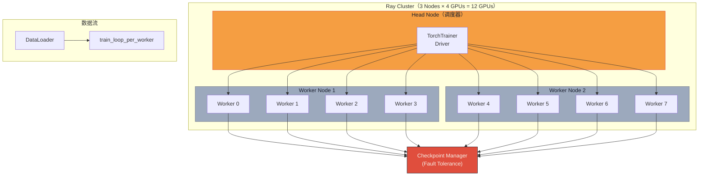

# 系列-05 · Distributed Training · 从单卡到集群（下篇）：Ray Train 实战与分布式未来

> **系列导航**：[上篇·单卡账本 + 省钱三件套](@/blog/inference-engineering/inference-engineering-series-05-a-distributed-training.md) | [中篇·DP + ZeRO-1/2/3 全图](@/blog/inference-engineering/inference-engineering-series-05-b-distributed-training.md)
> **完整长文**：[公众号文-05-Distributed-Training-详解.md](#)

---

## 一句话承上启下

> **中篇讲了 ZeRO-3/FSDP 的原理——这一篇讲怎么用 5 个 API 把它跑起来。**
> Ray Train 是分布式训练的"操作系统层"：屏蔽了 torchrun、进程管理、故障恢复、checkpoint 调度这些脏活累活，让工程师专注模型和训练逻辑本身。
> 附：CIFAR-10 + VisionTransformer 完整可运行代码 + Pipeline/Tensor/Sequence Parallel 预告。

---

## Part 1 · Ray 是什么：统一分布式计算引擎

### 1.1 背景痛点

从单卡到多机多卡，痛苦不是模型本身，而是：

| 挑战 | 描述 |
|---|---|
| 集群管理 | 手动分配节点、配置网络、启动进程 |
| 故障容忍 | 节点挂了要从最近的 checkpoint 恢复，不能从头重来 |
| 资源调度 | CPU-GPU 协同、动态扩缩容 |
| 工程 Boilerplate | 手动管理 DDP 多进程、All-Reduce 通信 |

PyTorch 原生 `torchrun` 只解决了"启动"的问题，其余全部甩给工程师。

### 1.2 Ray 的两套抽象

| 抽象 | 适用场景 | API |
|---|---|---|
| **Ray Core** | 通用分布式（任意 Python 函数/类） | `@ray.remote`，`ray.get()`，`ActorHandle` |
| **Ray AI 库** | 专用 AI 任务 | Ray Train / Ray Data / Ray Tune / Ray Serve / Ray RLlib |

Ray Train 站在 Ray Core 之上，专门解决**分布式训练**问题。

### 1.3 Ray Train 架构



> **Ray Train 5 个最小 API**：下篇核心就是围绕这 5 个 API 展开。

| API | 作用 |
|---|---|
| `ScalingConfig` | 指定 Worker 数量、GPU 分配策略 |
| `TorchTrainer` | 分布式训练任务管理器 |
| `ray.train.torch.prepare_model` | 把 PyTorch 模型包装成 FSDP/DDP |
| `ray.train.Checkpoint` | 故障恢复的检查点抽象 |
| `ray.train.report` | 指标上报 + checkpoint 触发 |

---

## Part 2 · 单卡基准：CIFAR-10 + VisionTransformer

> **先跑通单卡，证明逻辑正确，再上分布式。**

### 2.1 数据加载

```python
from torchvision import datasets, transforms
from torch.utils.data import DataLoader
from filelock import FileLock
import os

def get_dataloaders(batch_size):
    transform = transforms.Compose([
        transforms.ToTensor(),
        transforms.Normalize((0.5, 0.5, 0.5), (0.5, 0.5, 0.5)),
    ])
    with FileLock(os.path.expanduser("~/data.lock")):
        train_data = datasets.CIFAR10(
            root="~/data", train=True, download=True, transform=transform
        )
        test_data = datasets.CIFAR10(
            root="~/data", train=False, download=True, transform=transform
        )
    return (
        DataLoader(train_data, batch_size=batch_size, shuffle=True),
        DataLoader(test_data, batch_size=batch_size),
    )
```

### 2.2 单卡训练函数（完整可运行）

```python
from torchvision.models import VisionTransformer
from torch import nn
import torch
from tqdm import tqdm

def train_func(lr=1e-3, epochs=10, batch_size=512):
    # 1. Data
    train_loader, val_loader = get_dataloaders(batch_size=batch_size)

    # 2. Model（ViT on CIFAR-10 32x32）
    model = VisionTransformer(
        image_size=32,
        patch_size=4,
        num_layers=12,
        num_heads=8,
        hidden_dim=384,
        mlp_dim=768,
        num_classes=10,
    )

    # 3. Device + Mixed Precision
    device = torch.device(
        'cuda' if torch.cuda.is_available() else
        'mps' if torch.backends.mps.is_available() else 'cpu'
    )
    model.to(device)

    # 4. Loss + Optimizer
    loss_fn = nn.CrossEntropyLoss()
    optimizer = torch.optim.AdamW(model.parameters(), lr=lr, weight_decay=1e-2)

    # 5. Training Loop
    for epoch in range(epochs):
        model.train()
        train_loss = 0.0
        for X, y in tqdm(train_loader, desc=f"Train Epoch {epoch+1}"):
            X, y = X.to(device), y.to(device)
            with torch.cuda.amp.autocast():        # ← Mixed Precision
                pred = model(X)
                loss = loss_fn(pred, y)
            optimizer.zero_grad()
            loss.backward()
            optimizer.step()
            train_loss += loss.item()
        train_loss /= len(train_loader)

        # 6. Validation
        model.eval()
        correct, total, val_loss = 0, 0, 0.0
        with torch.no_grad():
            for X, y in val_loader:
                X, y = X.to(device), y.to(device)
                pred = model(X)
                val_loss += loss_fn(pred, y).item() * X.shape[0]
                total += y.shape[0]
                correct += (pred.argmax(1) == y).sum().item()
        val_loss /= total
        print(f"  Epoch {epoch+1}: Train Loss={train_loss:.4f} | "
              f"Valid Loss={val_loss:.4f} | Acc={correct/total:.2%}")

    # 7. Checkpoint
    torch.save({
        'model_state_dict': model.state_dict(),
        'optimizer_state_dict': optimizer.state_dict(),
    }, 'checkpoint_single.pth')
```

单卡跑通后，迁移到 Ray Train 只需修改**4 处**（见下篇 Part 3）。

---

## Part 3 · Ray Train 分布式迁移（5 步）

### Step 1 · ScalingConfig：指定集群规模

```python
from ray.train import ScalingConfig

scaling_config = ScalingConfig(
    num_workers=8,               # 8 GPUs in cluster
    use_gpu=True,
    resources_per_worker={"CPU": 2, "GPU": 1},
)
```

### Step 2 · DataLoader + prepare_data_loader

```python
# DataLoader 本身不变，Ray 用 prepare_data_loader 做分布式包装
train_dl, valid_dl = get_dataloaders(batch_size=batch_size_per_worker)
train_dl = ray.train.torch.prepare_data_loader(train_dl)
valid_dl = ray.train.torch.prepare_data_loader(valid_dl)
```

### Step 3 · prepare_model（FSDP/DDP 切换）

```python
# 分布式的关键一行：FSDP = PyTorch 原生 ZeRO-3
model = ray.train.torch.prepare_model(
    model,
    parallel_strategy="fsdp"   # 改这里切 DDP ↔ FSDP
)
```

### Step 4 · ray.train.report：指标上报 + Checkpoint

```python
metrics = {
    "epoch": epoch + 1,
    "train_loss": train_loss,
    "valid_loss": valid_loss,
    "accuracy": accuracy,
}

if (epoch + 1) % 5 == 0:
    # 每 5 个 epoch 存一次 checkpoint（用于故障恢复）
    with tempfile.TemporaryDirectory() as ckpt_dir:
        torch.save(model.module.state_dict(),
                   os.path.join(ckpt_dir, "model.pt"))
        ray.train.report(
            metrics,
            checkpoint=ray.train.Checkpoint.from_directory(ckpt_dir)
        )
else:
    ray.train.report(metrics)  # 仅上报指标，不写盘
```

### Step 5 · TorchTrainer + fit：启动

```python
from ray.train.torch import TorchTrainer

global_batch_size = 1024
num_workers = 8
batch_size_per_worker = global_batch_size // num_workers   # 1024/8=128

train_loop_config = {
    "lr": 1e-3,
    "epochs": 20,
    "batch_size_per_worker": batch_size_per_worker,
}

trainer = TorchTrainer(
    train_loop_per_worker=train_func_per_worker,
    train_loop_config=train_loop_config,
    scaling_config=scaling_config,
    run_config=RunConfig(
        name="cifar10_fsdp",
        storage_path="/mnt/cluster_storage/training/",
        checkpoint_config=CheckpointConfig(
            num_to_keep=2,
            checkpoint_score_attribute="accuracy",
            checkpoint_score_order="max",
        ),
    ),
)

result = trainer.fit()   # ← 启动多机多卡训练
```

---

## Part 4 · 完整 train_func_per_worker（可运行）

```python
import os
import tempfile
import ray
from ray.train import ScalingConfig, RunConfig, CheckpointConfig
from ray.train.torch import TorchTrainer
from torch import nn
import torch
from torchvision.models import VisionTransformer
from torchvision import datasets, transforms
from torch.utils.data import DataLoader
from filelock import FileLock

# ── Data ──────────────────────────────────────────────────────
def get_dataloaders(batch_size):
    transform = transforms.Compose([
        transforms.ToTensor(),
        transforms.Normalize((0.5, 0.5, 0.5), (0.5, 0.5, 0.5)),
    ])
    with FileLock(os.path.expanduser("~/data.lock")):
        train_ds = datasets.CIFAR10("~/data", train=True, download=True, transform=transform)
        valid_ds = datasets.CIFAR10("~/data", train=False, download=True, transform=transform)
    return (
        DataLoader(train_ds, batch_size=batch_size, shuffle=True),
        DataLoader(valid_ds, batch_size=batch_size),
    )

# ── Per-Worker Training Function ──────────────────────────────
def train_func_per_worker(config):
    lr = config["lr"]
    epochs = config["epochs"]
    batch_size = config["batch_size_per_worker"]

    ctx = ray.train.get_context()
    world_size = ctx.get_world_size()
    local_rank = ctx.get_world_rank()
    if local_rank == 0:
        print(f"[FSDP] Training across {world_size} workers ...")

    # Data
    train_loader, valid_loader = get_dataloaders(batch_size)
    train_loader = ray.train.torch.prepare_data_loader(train_loader)
    valid_loader = ray.train.torch.prepare_data_loader(valid_loader)

    # Model
    model = VisionTransformer(
        image_size=32, patch_size=4,
        num_layers=12, num_heads=8,
        hidden_dim=384, mlp_dim=768, num_classes=10,
    )

    # [FSDP] ← 关键切换
    model = ray.train.torch.prepare_model(model, parallel_strategy="fsdp")

    # Loss + Optimizer
    criterion = nn.CrossEntropyLoss()
    optimizer = torch.optim.AdamW(model.parameters(), lr=lr, weight_decay=1e-2)

    for epoch in range(epochs):
        # Train
        model.train()
        train_loss, n = 0.0, 0
        for X, y in train_loader:
            pred = model(X)
            loss = criterion(pred, y)
            optimizer.zero_grad()
            loss.backward()
            optimizer.step()
            train_loss += loss.item() * X.shape[0]
            n += X.shape[0]
        train_loss /= n

        # Valid
        model.eval()
        correct, total, val_loss = 0, 0, 0.0
        with torch.no_grad():
            for X, y in valid_loader:
                pred = model(X)
                val_loss += criterion(pred, y).item() * X.shape[0]
                total += y.shape[0]
                correct += (pred.argmax(dim=1) == y).sum().item()
        val_loss /= total
        accuracy = correct / total

        metrics = {
            "epoch": epoch + 1,
            "train_loss": train_loss,
            "valid_loss": val_loss,
            "accuracy": accuracy,
        }

        # Checkpoint every 5 epochs
        if (epoch + 1) % 5 == 0:
            with tempfile.TemporaryDirectory() as ckpt_dir:
                torch.save(model.module.state_dict(),
                           os.path.join(ckpt_dir, "model.pt"))
                ray.train.report(
                    metrics,
                    checkpoint=ray.train.Checkpoint.from_directory(ckpt_dir),
                )
        else:
            ray.train.report(metrics)

# ── Launch ────────────────────────────────────────────────────
scaling_config = ScalingConfig(
    num_workers=8, use_gpu=True,
    resources_per_worker={"CPU": 2, "GPU": 1},
)
run_config = RunConfig(
    name="cifar10_fsdp",
    storage_path="/mnt/cluster_storage/training/",
    checkpoint_config=CheckpointConfig(
        num_to_keep=2,
        checkpoint_score_attribute="accuracy",
        checkpoint_score_order="max",
    ),
)

global_batch_size = 1024
batch_size_per_worker = global_batch_size // 8

trainer = TorchTrainer(
    train_loop_per_worker=train_func_per_worker,
    train_loop_config={
        "lr": 1e-3, "epochs": 20,
        "batch_size_per_worker": batch_size_per_worker,
    },
    scaling_config=scaling_config,
    run_config=run_config,
)

result = trainer.fit()   # 多机多卡 FSDP 启动
```

> **代码对比（单卡 → Ray Train）**：改动点仅 4 处——ScalingConfig、prepare_data_loader、prepare_model(parallel_strategy="fsdp")、ray.train.report。单卡训练逻辑**零改动**。

---

## Part 5 · 分布式未来：Pipeline / Tensor / Sequence Parallel 预告

> **决策 5：以下三种并行方式中篇已说明不展开，此处仅作预告和资源索引。**

| 并行方式 | 切分维度 | 适用场景 | 代表框架 |
|---|---|---|---|
| **Pipeline Parallel（PP）** | 按层切分 | 层数极多（ decoder-only LLM） | DeepSpeed, Megatron-LM |
| **Tensor Parallel（TP）** | 按张量维度切分 | 单层参数极大（embedding / MLP） | Megatron-LM, PyTorch TP |
| **Sequence Parallel（SP）** | 按 seq 维度切分 | 超长上下文（>32K） | - |

**为什么需要 PP / TP**：

| 方案 | 可训模型规模 | 通信模式 | 瓶颈 |
|---|---|---|---|
| ZeRO-3/FSDP（64 卡） | ~320B | $3\Psi$ All-Gather | 参数分片足够大 |
| + Pipeline Parallel | ~1T+ | Stage 间微批次流水线 | 流水线气泡 |
| + Tensor Parallel | 突破单卡层参数限制 | intra-layer All-Reduce | NVLink 带宽 |

**资源索引**：
- Megatron-LM（NVIDIA）：https://github.com/NVIDIA/Megatron-LM
- DeepSpeed ZeRO + PP/TP：https://github.com/microsoft/DeepSpeed
- Colossus-AI（国产）：https://github.com/hpcaitech/ColossalAI

> **系列-07 候选主题**：Pipeline Parallel / Tensor Parallel / Sequence Parallel 工程细节。

---

## Part 6 · 国内大厂案例

### 6.1 智源人工智能研究院 Aquila

智源（Beijing Academy of Artificial Intelligence）在 2023 年开源 Aquila-7B：
- 使用 Colossus-AI（国产分布式训练框架）对标 Megatron-LM
- 公开了 ZeRO-3 + PP 混合并行的训练配置
- 在 64 卡 A100 集群上完成 2T tokens 预训练

### 6.2 阿里云 PAI × DeepSpeed 集成

阿里云机器学习平台 PAI 在 2024 年正式集成 Microsoft DeepSpeed：
- 提供可视化 ZeRO 配置（ZeRO-1/2/3 一键切换）
- 支持 FSDP 和 Pipeline Parallel 组合
- 在百亿参数模型上验证了混合并行的扩展效率

---

## 本篇小结

| 概念 | 一句话 |
|---|---|
| Ray Train 5 API | ScalingConfig + TorchTrainer + prepare_model + Checkpoint + ray.train.report |
| train_func_per_worker | 单卡训练逻辑 4 处改动即可分布式化 |
| FSDP = PyTorch ZeRO-3 | `prepare_model(parallel_strategy="fsdp")` 一行切换 |
| Checkpoint 策略 | 每 5 epoch 存盘，Ray 自动管理故障恢复 |
| PP/TP/SP | 不是 DP/ZeRO 的替代，是不同维度的切分——留给系列-07 |

**分布式训练全链路总结**：

```
单卡瓶颈（16Ψ bytes）
    ↓ 三件套（checkpoint / accum / mixed precision）
    ↓
单卡可训模型规模上限
    ↓ 模型超出单卡容量（70B+）
    ↓
Data Parallel（每卡完整副本，All-Reduce）
    ↓ ZeRO-1（优化器分片，4.2 bytes/param）
    ↓ ZeRO-2（+梯度分片，2.2 bytes/param）
    ↓ ZeRO-3/FSDP（全量分片，0.25 bytes/param）
    ↓
Ray Train 框架（5 API → 多机多卡 FSDP）
    ↓ 更大规模（>320B）
    ↓ Pipeline/Tensor/Sequence Parallel（系列-07）
```

---

*风格沿用：系列-02 KV Cache 长文风格（机制 → 公式 → 国内案例 → 工程师视角）*
*系列 3/3 · Distributed Training 下篇 · 来源：Suman Debnath / debnsuma.github.io*
