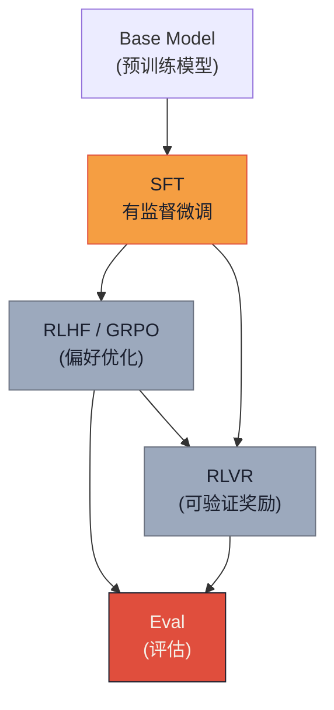

# 系列-06 · Post-Training 101 · 从 base 到 instruct（上）：SFT 全景

> **系列导航**：[中篇·RL 五大奖励族](@/blog/inference-engineering/inference-engineering-series-06-b-post-training.md) | [下篇·算法矩阵 + 评估体系](@/blog/inference-engineering/inference-engineering-series-06-c-post-training.md)
> **完整长文**：[公众号文-06-Post-Training-详解.md](#)

---

## 一句话开场

> **ChatGPT 能听懂"请帮我写一封邮件"，而 GPT-3 只会续写"请帮我写一封邮件，邮件的内容是..."。**
> **——这个从"续写"到"听话"的鸿沟，就是 Post-Training 要填的坑。**

本篇（上）聚焦 **SFT（Supervised Fine-Tuning）全景**——数据 / Loss / Batch 三件套，配国内大厂真实案例，讲透为什么"SFT 数据质量 > 一切"这个工程真理。

---

## Part 1 · 为什么 base model 不会"听话"

**原文**（Tokens for Thoughts，下略为"原文"）：

> A base model (or a pre-trained model) is usually created by pre-training on large-scale text and image data. The primary goal of pre-training is to encode the world's knowledge into the model. The training objective is quite straightforward: the model is trained to predict the next token over many different sequences prior to it.

**关键洞察**：

> **Pre-training 的目标只有一个：预测下一个 token。** 它不关心"用户想要什么"，只关心"根据上文，什么词最可能出现在这里"。

**同一问题，两种行为**：

```
用户输入："What is the capital city of U.S."

Base model（只会续写）：
  "? The capital city of U.S. is..."   ← 先预测问号，续写完整个句子

Instruct model（听懂指令）：
  "Washington, D.C."                   ← 直接回答用户问题
```

**工程师视角**：

> Pre-training 是"装知识"——把互联网上的海量文本压缩进权重。
> Post-training 是"装指令"——让模型学会"用户在让我做什么"。
> 两者训练目标完全不同，所以 base model 在 instruct 任务上天然弱。

---

## Part 2 · Post-Training 生命周期总览

**原文**：

> At a high-level, post-training is the process of taking a base model and turning it into an instruction-tuned model that is both helpful and safe for users. There are usually two main families of training techniques: supervised fine-tuning (SFT) and reinforcement learning (RL).

**后训练两条路**：

| 阶段 | 方法 | 核心数据 | 作用 |
|---|---|---|---|
| **SFT** | 有监督微调 | (prompt, response) 人工标注对 | 教模型"怎么回答"，打基础 |
| **RL** | 强化学习 | 偏好数据 / 可验证奖励 | 教模型"回答得更好"，拔上限 |

**完整生命周期（原文 Figure 3）**：



**历史脉络（原文 Section 2）**：

```
2022  InstructGPT   → SFT + RLHF（OpenAI，两阶段）
2024  DeepSeek-V3  → SFT + RLVR（VR = Verifiable Rewards，规则奖励）
2025  DeepSeek-R1  → R1-zero（直接 RL on base）→ R1（推理导向 RL → 人类偏好 RL）
```

> **本系列不做 R1 工程化深度展开**（见素材盘点决策 6），只在本篇保留知识地图——R1 / V3 的完整工程细节留给系列-08。

---

## Part 3 · SFT 全景

### 3.1 数据：Instruction-Response Pairs

**原文**：

> The dataset is a collection of instruction-response pairs (x, y), where x is an input instruction or prompt and y is the target output (human-written or high-quality model-generated).

**JSON 示例**（原文 DATA EXAMPLES）：

```json
{
  "prompt": [
    {"role": "system", "content": "You are a helpful, honest assistant."},
    {"role": "user", "content": "What is the capital city of U.S."}
  ],
  "completion": [
    {"role": "assistant", "content": "The capital of the United States is Washington, D.C."}
  ]
}
```

**规模**：SFT 数据集通常 O(10K) ~ O(100K)，远小于预训练的万亿 token 级。体量小 = **质量敏感度高，噪声 1% 就能毁掉整个 SFT**。

---

### 3.2 数据质量 8 维度表（原文 Table · SFT Dataset）

> 原文给出了一张完整的数据质量检查流水线，强调"即使小比例的低质量样本也会教出错误行为"。

| # | 维度 | 期望 | 典型问题 |
|---|---|---|---|
| 1 | **Correctness（正确性）** | 每个答案必须事实准确、逻辑成立、与 prompt 一致 | 错答、漏步、矛盾 |
| 2 | **Consistency（一致性）** | 风格、格式、推理结构全局统一 | 同一问题两种答法 |
| 3 | **Completeness（完整性）** | 响应完整解决问题，不给 partial answer | 捷径思维、跳过关键步骤 |
| 4 | **Clarity（清晰性）** | 无无关旁白、无填充词、无矛盾推理步 | 模板填充、逻辑跳步 |
| 5 | **Coverage（覆盖度）** | 数据集覆盖不同领域、复杂度、推理深度 | 只做数学 / 只做短答案 |
| 6 | **Verifiability（可验证性）** | 输出可被核查（数学重算、代码执行、推理可跟随） | 不可复核的开放式回答 |
| 7 | **Balance（均衡性）** | 短/简单任务 与 长/复杂任务 混合 | 模型 overfit 单一格式 |
| 8 | **Alignment（对齐性）** | 输出反映目标风格（helpful, concise, safe） | 过于冗长或过于简洁 |

**三大 SFT 数据杀手**（原文 Section 3.1）：

| 类型 | 定义 | 后果 |
|---|---|---|
| **Label Noise（标签噪声）** | 标注者或 Teacher Model 给出了错误、不完整、不一致的答案 | 模型学会错误关联 |
| **Distribution Mismatch（分布失配）** | SFT 数据太窄（如只做数学），真实场景泛化差 | 微调后反而变差 |
| **Spurious Reasoning（伪推理）** | CoT 看起来 step-by-step，实际有逻辑缺口或复制粘贴模板 | 模型学会"装思考" |

**缓解方法**：过滤（自动 / 人工质量检查）+ 验证（held-out gold set）+ 增强（多样本平衡 + 高质量 Teacher 生成）。

**工程师笔记**：

> **SFT 数据质量 > 一切。** Gemini 2.5 Pro 论文专门强调：post-training 的进步"driven by a **consistent focus on data quality** across the SFT, RM, and RL stages"。

---

### 3.3 SFT Loss：Negative Log-Likelihood

**原文公式**：

$$
\mathcal{L}_{\text{SFT}}(\theta) = -\mathbb{E}_{(x,y) \sim \mathcal{D}} \sum_{t=1}^{T} \log p_{\theta}(y_t | x, y_{<t})
$$

**工程实现（PyTorch）**：

```python
# 原文：F.cross_entropy(...) implements the numerically stable NLL
logits = model(input_ids)  # [batch, seq_len, vocab_size]
loss = F.cross_entropy(
    logits.view(-1, vocab_size),  # [batch * seq_len, vocab_size]
    target.view(-1)               # [batch * seq_len]
)
# 内部自动做 log-sum-exp 数值稳定实现
```

**Loss 只在 response tokens 上算**（原文强调）：prompt tokens 的 loss 被 mask 掉，不参与梯度更新。

---

### 3.4 数值稳定：Log-Sum-Exp Trick

**原文**（Section 3.2 Numerical Stability）：

> The second term is the commonly seen "log-sum-exp" term. Often this is computed in a numerically stable way:

$$
\log \sum_{v=1}^{V} \exp(z_{t,v}) = m + \log \sum_{v=1}^{V} \exp(z_{t,v} - m)
$$

其中 $m = \max_{v} z_{t,v}$。

**为什么需要这个技巧**：直接算 $\log \sum \exp(z_v)$ 会溢出——当 $z_v$ 很大时 $\exp(z_v)$ 是 inf。

**工程实现已封装在 `F.cross_entropy`**：不需要手动写 log-sum-exp。

---

### 3.5 Batch 策略：Dynamic Batching / Packed Sequences

**原文**（Section 3.3 How SFT Data Is Batched and Padded）：

**Naive Batching 的浪费**：

```
Example 1: [The, cat, sat]           → length 3
Example 2: [Dogs, bark, loudly, at, night] → length 5

合并为一个 batch → 需要 padding 到 seq_len=5：
[PAD, PAD, The, cat, sat]
[ Dogs, bark, loudly, at, night]

Attention mask（告诉模型忽略 PAD）：
[0, 0, 1, 1, 1]
[1, 1, 1, 1, 1]
```

**三种实际工程策略**（原文 Section 3.3）：

| 策略 | 原理 | 优点 |
|---|---|---|
| **Dynamic Batching（长度桶）** | 把长度相近的样本打包成同一个 batch | 减少 padding 浪费 |
| **Packed Sequences（打包）** | 多条短样本拼接成一条长序列，用特殊 token 分隔 | 完全消除 padding，极限利用 GPU |
| **Attention Mask 屏蔽** | PAD token 位置 mask=0，loss 不回传 | 梯度正确，只更新真实 token |

**Curriculum Design（原文 Section 3.2 Notes）**：

> The structure of training data significantly impacts performance. An effective approach is to begin with simple instructions and gradually introduce more complex, multi-turn interactions.

---

## 国内大厂案例 · DeepSeek-V3 SFT 数据流水线

**DeepSeek-V3 的 SFT 数据策略**（来自 DeepSeek-V3 Technical Report）：

```
数据来源 = 人工标注 + 合成数据（Teacher Model 生成）

合成数据 pipeline：
  1. 从预训练语料中抽取高质量文档
  2. 用 DeepSeek-V2-Code 生成 instruction-response pairs
  3. 质量过滤：LLM-as-judge 评分 + 人工抽检
  4. 最终保留：数学 / 代码 / 推理 / 对话 多样化混合

关键数字（DeepSeek-V3 Technical Report）：
  - SFT 阶段使用数百万条高质量 instruction pairs
  - 包含长上下文任务（128K seq_len）
  - 数据配比经过仔细的 ablation 实验
```

**Qwen2.5 后训练数据策略**（来自 Qwen2.5 技术博客）：

```
- 人工标注团队：数百名标注者，严格遵循标注指南
- 质量过滤：自动化 + 人工二次抽检
- 覆盖度：数学 / 代码 / 推理 / 对话 / 安全 多维覆盖
- 关键洞察："10K-100K 高质量样本 > 1M 噪声样本"（与原文 Section 3.1 一致）
```

**工程师视角**：

> 国内大厂的实际经验验证了原文的核心论点：**后训练数据质量 > 一切**。
> DeepSeek-V3 的合成数据 pipeline 值得参考：LLM-as-judge 做初筛 + 人工抽检兜底，是目前最可扩展的高质量 SFT 数据方案。

---

## 本篇小结

| Part | 一句话 | 上篇搞清了吗 |
|---|---|---|
| 1 · Base model 局限性 | Pre-training 只学"续写"，不学"指令" | ✓ |
| 2 · 后训练生命周期 | SFT → RLHF/GRPO/RLVR → Eval | ✓ |
| 3.1 · SFT 数据 | (prompt, response) pairs，**质量 > 数量** | ✓ |
| 3.2 · 数据质量 8 维度 | Correctness / Consistency / Completeness / Clarity / Coverage / Verifiability / Balance / Alignment | ✓ |
| 3.3 · SFT Loss | NLL，只在 response tokens 上算 | ✓ |
| 3.4 · 数值稳定 | log-sum-exp trick（`F.cross_entropy` 已封装） | ✓ |
| 3.5 · Batch 策略 | Dynamic Batching / Packed Sequences / Attention Mask | ✓ |

**下篇预告（中）**：**RL 五大奖励族横向对比**——RLHF / RLAIF / RLVR / PRM / Rubric-Guided Rewards；Bradley-Terry 偏好模型；KL 正则化目标。

---

*风格沿用：系列-02-A-KVCache-上篇.md（YAML frontmatter / 5段式 / 工程师视角三栏 / LaTeX公式 / Mermaid图）*
*系列 1/3 · Post-Training 101 · SFT 全景*
*来源素材：Post-training 101 | Tokens for Thoughts（Han Fang & Karthik A. Sankararaman，2026-09-09）*
