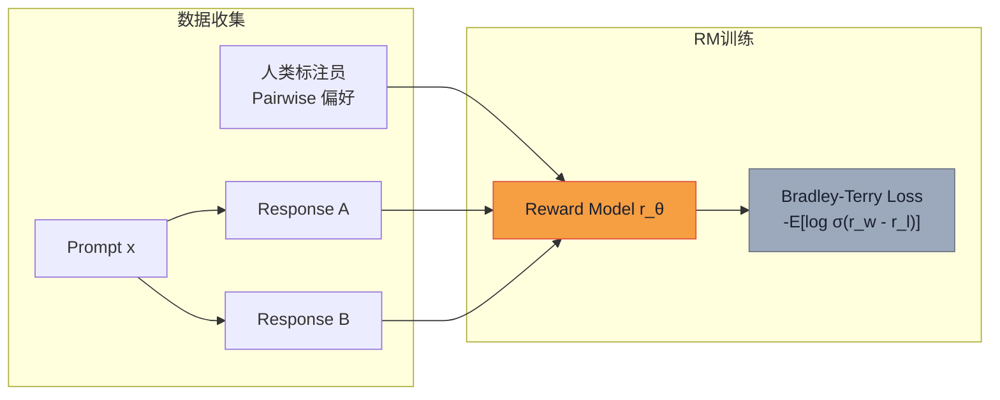

# 系列-06 · Post-Training 101 · 从 base 到 instruct（中）：RL 五大奖励族

> **系列导航**：[上篇·SFT 全景](@/blog/inference-engineering/inference-engineering-series-06-a-post-training.md) | [下篇·算法矩阵 + 评估体系](@/blog/inference-engineering/inference-engineering-series-06-c-post-training.md)
> **完整长文**：[公众号文-06-Post-Training-详解.md](#)

---

## 一句话开场

> **SFT 教模型"怎么回答"，RL 教模型"回答得更好"。**
> **但"更好"需要一个定义——五大 RL 奖励族，就是五种定义"更好"的方式。**
> **它们的适用边界，比"都很好，看情况"要精确得多。**

---

## Part 1 · RL 核心目标：KL 正则化

**原文**（Section 4 RL Rewards）：

> We optimize a KL-regularized objective—i.e., apply policy-gradient updates while penalizing divergence from the reference model to prevent drift.

**KL 正则化目标**（原文核心公式）：

$$
\max_{\pi}\;\mathbb{E}_{y\sim \pi(\cdot\mid x)}\big[r(x,y)\big]\;-\;\beta\,\mathrm{KL}\!\left(\pi(\cdot\mid x)\,\|\,\pi_{0}(\cdot\mid x)\right)
$$

**三项拆解**：

| 符号 | 含义 | 工程解释 |
|---|---|---|
| $r(x,y)$ | 奖励函数 | 给回答打分（越高越好） |
| $\pi(\cdot|x)$ | 当前策略（正在训练的模型） | 我们要更新的 policy |
| $\pi_0(\cdot|x)$ | 参考策略（SFT 模型） | 不能偏离太远的锚点 |
| $\beta$ | KL 惩罚系数 | 控制"多像原模型" |

**工程师视角**：

> KL 项是 RLHF 的"护栏"——防止模型为了最大化奖励而完全跑偏。
> 没有 KL 项：模型可能学会"刷奖励分"而不是"真正好的回答"。
> $\beta$ 太小：模型漂移；$\beta$ 太大：模型学不动。

---

## Part 2 · 五大奖励族横向对比表

**原文 Table（Section 4 RL Rewards）**：

| 奖励族 | 奖励来源 | 典型任务 | 优点 | 缺点 |
|---|---|---|---|---|
| **RLHF**（人类偏好） | 人类标注员 pairwise 比较 | General chat / 安全 / 风格对齐 | 鲁棒，研究充分，覆盖面广 | RM 漂移 / 奖励黑客 / 标注贵 |
| **RLAIF**（AI 反馈） | LLM-as-judge + Constitution 引导 | 可扩展的 helpfulness/harmlessness | 便宜，快迭代 | 法官偏见 / 反馈循环 / 领域错配 |
| **RLVR**（可验证奖励） | 程序化验证（单元测试 / 精确匹配） | 数学 / 代码 / 事实 QA | 精确，低噪声信号；强推理 | 稀疏奖励；可被 grader 欺骗；覆盖缺口 |
| **PRM**（过程奖励） | 过程奖励模型（PRM）逐 step 打分 | 长程推理 / 工具调用 | 信用分配更细；提升忠诚度 | step 标签贵；PRM OOD 脆弱 |
| **Rubric-guided**（评分卡） | LLM-judge 按 rubric 逐项打分 / PRM / 可执行检查 | Helpfulness/safety 审计 / 风格合规；数学/代码（rubric 可执行时） | 奖励与意图对齐；灵活跨任务 | Goodharting 加权标准；关键词/冗长度作弊；法官校准漂移 |

---

## Part 3 · 每种奖励族的适用边界（核心价值）

### RLHF：通用对话 + 安全对齐

**原文**：

> RLHF helps the model excel in general chats and align its safety/stylistic behaviors by leveraging reward models (RMs) trained from human preferences.

**什么时候用 RLHF**：

```
✅ 通用聊天 / 开放式生成
✅ 安全 / harmlessness 对齐
✅ 需要广泛覆盖多种任务类型
✅ 有预算雇佣/管理标注团队
❌ 任务可以被程序化验证（数学/代码）——用 RLVR
❌ 数据标注成本是瓶颈——用 RLAIF
```

**数据格式**（原文 DATA EXAMPLES）：

```json
{
  "prompt": [
    {"role": "user", "content": "What is the capital city of U.S."}
  ],
  "chosen":    {"role": "assistant", "content": "Washington, D.C."},
  "rejected":  {"role": "assistant", "content": "? The capital of the United States is Washington, D.C."}
}
```

---

### RLAIF：可扩展的 AI 监督

**原文**（Section 4 RLAIF / Constitutional AI）：

> RLAIF (AI feedback)—also known as Constitutional AI proposed by Anthropic—uses an LLM together with a written "constitution" to scale supervision and generate preference signals.

**Constitutional AI 核心思想**：

```
1. 写一部"宪法"（Constitution）：一系列原则（如"不伤害"、"有帮助"）
2. 让 LLM 根据宪法判断两个回答哪个更好
3. 用 LLM 判断结果训练 RM
4. 用 RM 做 RL
```

**什么时候用 RLAIF**：

```
✅ 需要快速迭代，标注成本是瓶颈
✅ 任务需要大规模偏好数据
✅ 有明文标准和规则（Constitution）可循
❌ 需要专家级判断（医学/法律）——用人类专家
❌ 安全关键场景——用 RLHF + 人工抽查
```

---

### RLVR：数学 / 代码 / 可验证任务

**原文**（Section 4 RLVR）：

> RLVR is a strong lever for improving math reasoning and coding by using ground-truth answers, unit tests, and code execution as precise signals.

**什么时候用 RLVR**：

```
✅ 数学题（有精确答案）
✅ 代码生成（有单元测试）
✅ 事实性 QA（有标准答案）
✅ 任务可被程序化验证
❌ 开放式聊天 / 创意写作——用 RLHF
❌ 风格/安全性——用 RLHF 或 Rubric-guided
```

**JSON 示例**（原文 Verifiable rewards DATA EXAMPLES）：

```json
// 数学题
{
  "prompt": [{"role": "user", "content": "Solve: (3x - 2)(x + 5) = 0. Provide only the roots separated by commas in ascending order."}],
  "metadata": {
    "ground truth": "-5, 0.6666667",
    "reward": 1.0,
    "scorer": "math_grader"
  }
}

// 代码题
{
  "prompt": [{"role": "user", "content": "Implement is_palindrome(s: str) -> bool."}],
  "metadata": {
    "scorer": "code_grader",
    "suite": {
      "entry_point": "is_palindrome",
      "public_tests_count": 4,
      "hidden_tests_count": 18
    }
  }
}
```

---

### PRM：过程奖励，长程推理

**原文**（Section 4 Process-supervised RL）：

> Process supervision is more granular than RLVR, employing step-level rewards from a process reward model (PRM) to score intermediate steps in long-horizon tasks.

**RLVR vs PRM**：

```
RLVR（结果奖励）："答案对不对？1 分 or 0 分"
PRM（过程奖励）："这一步对不对？0.8 分 → 下一步对不对？0.6 分 → ..."

PRM 解决的是 RLVR 的"信用分配"问题：
  长推理链中，哪一步导致了最终错误？
  结果奖励给不出答案，PRM 可以。
```

**什么时候用 PRM**：

```
✅ 推理链很长的任务（math / 证明 / 复杂规划）
✅ 中间步骤可以被评估
✅ 需要训练模型"思考过程"正确，而不只是结果正确
❌ 短推理链（直接出答案）——RLVR 更高效
❌ 开放式任务——PRM 不适用
```

---

### Rubric-guided：灵活的任务规格

**原文**（Section 4 Rubrics-guided rewards）：

> Rubrics-guided rewards can be computed by checking whether a model's response satisfies explicit rubric criteria.

**Rubric 示例**（原文 DATA EXAMPLES）：

```json
{
  "rubric": {
    "scale": {"min": 1, "max": 7},
    "criteria": [
      {"id": "factuality",   "weight": 0.5, "definition": "Correct, non-misleading statements."},
      {"id": "helpfulness",  "weight": 0.3, "definition": "Directly answers the user's ask; useful context."},
      {"id": "concision",    "weight": 0.2, "definition": "No fluff; tight phrasing; avoids repetition."}
    ],
    "hard_rules": [
      {"if": "safety < 4", "then": "overall = 0"}
    ],
    "aggregate": "overall = 0.5*factuality + 0.3*helpfulness + 0.2*concision"
  }
}
```

**什么时候用 Rubric-guided**：

```
✅ 有明确评估维度的任务（factuality / helpfulness / safety）
✅ 需要多维度的加权组合
✅ 可执行 rubric（代码风格检查、安全扫描）
❌ 维度模糊、无法量化——RLHF 更适合
```

---

## Part 4 · Reward Model 训练：Bradley-Terry

**原文**（Section 4.2 Training rewards models）：

> A standard way to train a RM is derived from the Bradley-Terry model of preference.

**Bradley-Terry 偏好模型**（原文核心公式）：

$$
P(y_1 > y_2) = \frac{\exp(r(y_1))}{\exp(r(y_1)) + \exp(r(y_2))}
$$

**简化形式**（原文 Section 4.2）：

$$
P(y_1 > y_2) = \frac{1}{1 + \exp(r(y_2) - r(y_1))}
$$

**RM 训练的 Pairwise Loss**（原文推导）：

$$
\mathcal{L}_{\text{pair}}(\theta) = -\mathbb{E}\big[\log~\sigma\big(r_\theta(x, y_w) - r_\theta(x, y_l)\big)\big]
$$

其中 $y_w$ = chosen response，$y_l$ = rejected response。

**RM 训练流程**（原文 Section 4.2 + Figure 6）：



**RM 架构**：通常在预训练模型（或 SFT 前的 base model）上，加一个**标量输出头**（final token 的 hidden state 过线性层得到一个分数）。

**工程师视角**：

> Bradley-Terry 把"谁更好"的 pairwise 判断变成了可微的 loss。
> 核心洞察：不需要绝对分数，只需要相对偏好。
> 这让 RM 可以从人类标注数据中学习，而不需要显式标注"几分"。

---

## Part 5 · KL 正则化的工程实现

**原文**（Section 4 RL Rewards，per-token KL shaping）：

**Per-token KL 惩罚**（原文公式）：

$$
\tilde{r}_t^{\text{KL}} = -\beta\big(\log \pi_\theta(y_t|s_t) - \log \pi_0(y_t|s_t)\big)
$$

加到每个 token 的 return 上，防止策略偏离参考模型。

**两种 KL 控制方式**（原文 Section 4.1 PPO）：

| 方式 | 公式 | 特点 |
|---|---|---|
| **Global KL 惩罚** | $-\beta \cdot \text{KL}(\pi_\theta \| \pi_0)$ | 整条序列一个 KL 值，简单但粗糙 |
| **Per-token KL shaping** | $\tilde{r}_t^{\text{KL}} = -\beta(\log \pi_\theta - \log \pi_0)$ | 每个 token 一个 KL 值，更精细 |

**$\beta$ 调度策略**（原文 Section 4.1 PPO training loop）：

```
Adapt KL: adjust β toward a target KL per token and repeat.
```

实践中 $\beta$ 需要动态调整：
- KL 太大 → 增加 $\beta$（拉回参考模型）
- KL 太小 → 降低 $\beta$（让模型多探索）

---

## 国内大厂案例 · Anthropic Constitutional AI（RLAIF）

**Constitutional AI 核心流程**（Anthropic 2022，RLAIF 代表作）：

```
Step 1: 写一部 Constitution（"不伤害 / 有帮助 / 不撒谎"等原则）
Step 2: 让 LLM（Critique）根据 Constitution 判断当前回答
Step 3: 让 LLM（Revision）根据批评改进回答
Step 4: 用 (prompt, critique, revision) 三元组训练 SL-CAI（SFT 阶段）
Step 5: 用偏好数据训练 RLAIF RM
Step 6: RL 阶段用 RLAIF RM 做 reward
```

**关键洞察**：RLAIF 把"人类标注偏好"换成了"LLM 判断偏好"，大幅降低成本。

**阿里 PAI 偏好数据实践经验**：

```
- 偏好数据规模：通常 10K~100K pairwise comparisons
- 标注质量控制：每条数据 3 人标注，取多数投票
- 分布监控：实时监控 RM 预测与人工判断的吻合率（通常 > 75% 才上线）
- 安全红线：harmlessness 维度优先使用 RLHF，不用 RLAIF
```

---

## 本篇小结

| 奖励族 | 核心定义 | 适用边界 |
|---|---|---|
| **RLHF** | 人类 pairwise 偏好 → RM → RL | 通用对话 / 安全对齐 / 有标注预算 |
| **RLAIF** | LLM-as-judge + Constitution → RM → RL | 可扩展迭代 /helpful+无害 / 标注成本高 |
| **RLVR** | 程序化验证（测试 / 精确匹配）→ RL | 数学 / 代码 / 可验证任务 |
| **PRM** | 过程奖励模型，逐 step 打分 | 长推理链 / 信用分配问题 |
| **Rubric-guided** | rubric 逐项打分，加权求和 | 多维度评估 / 可执行 rubric |

**Bradley-Terry 公式必须记住**：

$$
P(y_1 > y_2) = \frac{\exp(r(y_1))}{\exp(r(y_1)) + \exp(r(y_2))}
$$

**KL 正则化目标必须记住**：

$$
\max_{\pi}\;\mathbb{E}\big[r(x,y)\big]\;-\;\beta\,\mathrm{KL}\!\left(\pi\,\|\,\pi_0\right)
$$

**下篇预告（下）**：**算法矩阵（PPO / GRPO / REINFORCE / DPO）+ 评估体系（Auto Eval / LLM-judge / Human Eval）**。

---

*风格沿用：系列-02-A-KVCache-上篇.md（YAML frontmatter / 5段式 / 工程师视角三栏 / LaTeX公式 / Mermaid图 / 对照表）*
*系列 2/3 · Post-Training 101 · RL 五大奖励族*
*来源素材：Post-training 101 | Tokens for Thoughts（Han Fang & Karthik A. Sankararaman，2026-09-09）*
