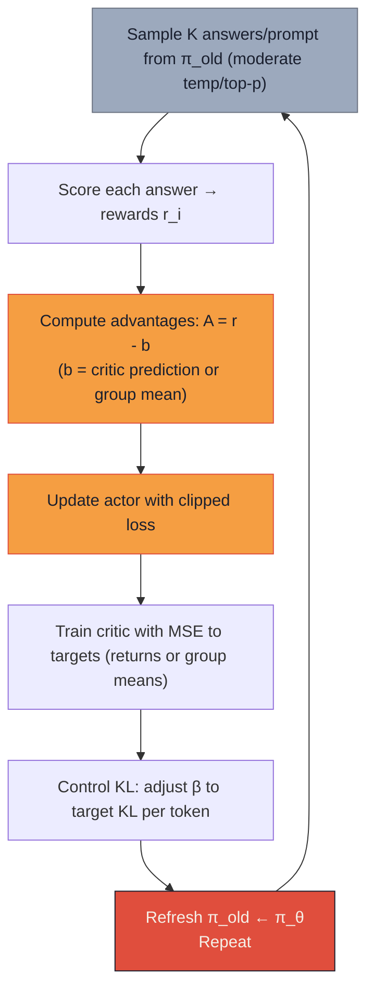

# 系列-06 · Post-Training 101 · 从 base 到 instruct（下）：算法矩阵 + 评估体系

> **系列导航**：[上篇·SFT 全景](@/blog/inference-engineering/inference-engineering-series-06-a-post-training.md) | [中篇·RL 五大奖励族](@/blog/inference-engineering/inference-engineering-series-06-b-post-training.md)
> **完整长文**：[公众号文-06-Post-Training-详解.md](#)

---

## 一句话开场

> **SFT 是基础，RL 是升华——但用哪种 RL 算法，决定了你是在"安全调优"还是"极限拔高"。**
> **PPO / GRPO / REINFORCE / DPO，四种算法不是"都行"，而是有明确的 if-then 选型边界。**

---

## Part 1 · 算法矩阵（四算法横向对比）

**原文 Table（Section 4.3 RL Algorithms）**：

| 算法 | 用 Critic？ | 需要 RM/Verifier？ | On/Off Policy | KL 控制 | 最佳场景 |
|---|---|---|---|---|---|
| **PPO** | Yes（value function） | Yes | On-policy | Global 或 per-token | RLHF/RLAIF（偏好），混合任务 |
| **GRPO** | No（critic-free） | Yes | On-policy | Per-token | RLVR（可验证数学/代码），长 CoT |
| **REINFORCE / RLOO** | No（仅 baseline） | Yes | On-policy | Per-token | 简单，高吞吐，多 rollout 场景 |
| **DPO**（非 RL） | No | No RM（直接用偏好） | Off-policy | 内置于 ref logits | 便宜，稳定的偏好调优 |

---

## Part 2 · PPO：带 Critic 的 On-Policy 算法

**原文**（Section 4.3 PPO）：

**PPO Clip 目标函数**（原文核心公式）：

$$
\mathcal{L}_{\text{policy}} = -\mathbb{E}_t \big[\min(r_t A_t,\; \texttt{clip}(r_t, 1-\epsilon, 1+\epsilon) \cdot A_t)\big]
$$

其中 $r_t = \exp(\log \Pi_\theta(y_t|s_t) - \log \Pi_{\text{old}}(y_t|s_t))$ 是概率比，$A_t$ 是 advantage（通常是整个 answer 的单个标量）。

**Clip 的作用**：

```
r_t > 1（概率比大）：当前策略比旧策略更倾向这个 token
r_t < 1（概率比小）：当前策略比旧策略更不倾向这个 token

PPO clip = 把 r_t 限制在 [1-ε, 1+ε] 范围内：
  r_t 太大 → clip 住 → 防止策略变化太剧烈
  r_t 太小 → clip 住 → 防止策略变化太剧烈
```

**Per-token KL shaping（原文 Section 4.1）**：

$$
\tilde{r}_t^{\text{KL}} = -\beta\big(\log \pi_\theta(y_t|s_t) - \log \pi_0(y_t|s_t)\big)
$$

加到 reward 上，防止策略偏离参考模型太远。

**PPO 训练循环**（原文 Section 4.3 PPO training loop）：



**Critic 的作用**：预测 expected returns，减少 advantage 估计的方差。

**何时用 PPO**：

```
✅ 偏好任务（RLHF / RLAIF）
✅ 需要稳定、鲁棒的策略更新
✅ 有足够的计算资源训练 critic
✅ 任务混合（chat + 工具调用 + 安全）
❌ 纯数学/代码可验证任务——用 GRPO（更便宜）
❌ 计算资源有限——用 DPO（不需要 critic）
```

---

## Part 3 · GRPO：Critic-Free 的工程最优解

**原文**（Section 4.3 GRPO）：

**GRPO 的核心创新**：不需要 critic 网络，用**组内均值作为 baseline**。

**GRPO Advantage 计算**（原文核心公式）：

$$
A_i = r_i - \bar{r} \quad \text{或} \quad A_i = r_i - \bar{r}_{-i}
$$

其中 $\bar{r} = \frac{1}{N}\sum r_i$ 是组内均值（group mean），$\bar{r}_{-i}$ 是 leave-one-out 均值。

**一个简单例子说清楚 GRPO**：

```
Prompt: "Solve 2+3=?"

采样 K=4 个回答：

回答 A: "5"       → reward = 1.0（正确）
回答 B: "6"       → reward = 0.0（错误）
回答 C: "2+3=5"   → reward = 0.8（有过程，正确）
回答 D: "7"       → reward = 0.0（错误）

组均值 baseline = (1.0 + 0.0 + 0.8 + 0.0) / 4 = 0.45

Advantage A = 1.0 - 0.45 = +0.55  → 强化
Advantage B = 0.0 - 0.45 = -0.45  → 弱化
Advantage C = 0.8 - 0.45 = +0.35  → 强化
Advantage D = 0.0 - 0.45 = -0.45  → 弱化

关键：不需要训练一个 critic 来预测"期望收益"
      只需要同 prompt 内的相对比较，就能做信用分配
```

**GRPO vs PPO 的核心差异**：

| 维度 | PPO | GRPO |
|---|---|---|
| Critic 网络 | 需要（独立训练） | 不需要 |
| Baseline | Critic 预测 | 组内均值（0 计算成本） |
| 内存开销 | 高（actor + critic + ref + rollout buffer） | 低（只有 actor + ref） |
| 适合任务 | 偏好任务（RLHF/RLAIF） | 可验证任务（RLVR、数学/代码） |
| 典型代表 | OpenAI InstructGPT | DeepSeek-V3 / DeepSeek-R1 |

**GRPO 训练循环**（原文 Section 4.3 GRPO training loop）：

```
1. Sample K answers/prompt with moderate temperature/top-p
2. Score each answer → response-level rewards r_i
3. Compute advantages: A_i = r_i - r̄（然后 within-prompt normalize: z-score or rank）
4. Update policy with REINFORCE per token using A_i and KL shaping to reference
5. Adapt KL: adjust β toward a target KL per token and repeat
```

**何时用 GRPO**：

```
✅ 数学 / 代码（RLVR，可验证奖励）
✅ 长 CoT 推理任务
✅ 计算资源有限（不需要 critic）
✅ DeepSeek-V3 / R1 系列模型
❌ 偏好任务（RLHF）——PPO 更成熟
❌ 开放式生成——偏好数据难以自动化验证
```

---

## Part 4 · DPO：不需要 Reward Model 的偏好调优

**原文**（Section 4.3 DPO）：

**DPO 的核心洞察**（原文 Section 4.3）：

> DPO is famous for not needing a reward model; it's cheap and stable, and is typically trained off-policy on fixed preference data.

**DPO Loss**（原文 Section 4.3 Bradley-Terry + DPO relation）：

DPO 实际上是在直接优化 Bradley-Terry 目标，不需要先训练 RM：

$$
\mathcal{L}_{\text{DPO}} = -\mathbb{E}_{(x,y_w,y_l)}\big[\log \sigma(r_\theta(x,y_w) - r_\theta(x,y_l))\big]
$$

**DPO vs PPO 的关键差异**：

| 维度 | PPO | DPO |
|---|---|---|
| 需要 RM？ | Yes | No |
| 需要 RM 训练？ | Yes（Bradley-Terry，额外一轮） | No |
| On/Off Policy | On-policy（需要当前 policy 采样） | Off-policy（在固定偏好数据上训练） |
| KL 控制 | 外加 KL 惩罚项 | 内置于 reference logits |
| 计算开销 | 高（actor + critic + rollout） | 低（只有 actor） |
| 稳定性 | 中等（PPO clip 提供保护） | 高（闭式解，不需要策略梯度） |

**何时用 DPO**：

```
✅ 偏好数据已固定，不需要再训 RM
✅ 计算资源有限
✅ 快速迭代验证偏好数据质量
✅ 作为 PPO 的基线对比
❌ 需要训 RM 的场景（偏好数据需要先验证）
❌ 开放式生成（DPO 对隐式偏好建模能力有限）
❌ 可验证任务（数学/代码）——用 GRPO
```

---

## Part 5 · REINFORCE：最简单的 Policy Gradient

**原文**（Section 4.3 REINFORCE / RLOO）：

**REINFORCE 核心公式**：

$$
A_i = r_i - b
$$

其中 $b$ 是一个 baseline（通常用组均值，即 GRPO 的 group baseline）。

**REINFORCE vs GRPO 的关系**：

> GRPO 实际上是 REINFORCE 的一种特例——用 group mean 作为 baseline，省掉了 critic。

**何时用 REINFORCE**：

```
✅ 最简单的 RL 场景
✅ 高吞吐 rollout（可以跑很多回答）
✅ 作为 baseline 对比实验
✅ 研究场景（教学/调试）
```

---

## Part 6 · 评估体系：Auto + LLM-Judge + Human

**原文 Section 5（Evaluation）总览**：

| 评估类型 | 成本 | 速度 | 适用场景 |
|---|---|---|---|
| **Auto Eval（Ground Truth）** | 低 | 快 | 数学 / 代码 / MCQ（有标准答案） |
| **LLM Judge** | 中 | 中 | 开放式生成（摘要 / 对话 / 创意） |
| **Human Eval** | 高 | 慢 | Gold standard（安全 / 关键任务） |

---

### 6.1 Auto Eval：Ground Truth 基于

**原文 Table（Section 5.1 Ground Truth Based Eval）**：

| 领域 | Benchmark | 指标 | 说明 |
|---|---|---|---|
| Math | **GSM8K** | Exact Match Accuracy | 算术应用题，step-by-step 推理 |
| Code | **HumanEval** | Pass@k（单元测试通过率） | 代码生成，单元测试验证 |
| MCQ Reasoning | **MMLU** | Accuracy（多选） | 57 个学科的知识与推理 |
| General Factuality | **TruthfulQA** | Truthfulness Score / EM | 事实正确性，规避常见误解 |

**GSM8K Grader 示例**（原文 DATA EXAMPLES）：

```python
def grade_gsm8k(gt_answer: int, model_output: str) -> dict:
    """Simple GSM8K grader."""
    # 1. Try \boxed{...}
    boxed = re.findall(r"\\boxed\{\s*([0-9,]+)\s*\}", model_output)
    if boxed:
        pred = int(boxed[-1].replace(",", ""))
    else:
        # 2. Fallback: last whole number
        nums = re.findall(r"\b[0-9][0-9,]*\b", model_output)
        pred = int(nums[-1].replace(",", "")) if nums else None
    return {
        "gt": gt_answer,
        "pred": pred,
        "correct": pred == gt_answer if pred is not None else False
    }
```

---

### 6.2 LLM Judge：开放式生成评估

**原文 Section 5.2（LLM Judge Based Eval）**：

| LLM-Judge 方式 | 原理 | 典型场景 |
|---|---|---|
| **Pairwise comparison** | 判断 Response A vs B 哪个更好 | Chatbot Arena |
| **Pointwise scoring** | 按 rubric 给单个 response 打分（1-7） | 摘要 / 对话质量 |
| **Reference-aware grading** | 对比 candidate 和 reference answer | 事实性 QA |
| **Safety red-teaming** | 检测 unsafe / biased / policy-violating 输出 | 安全评估 |

**Ground Truth vs LLM-Judge 对比表**（原文 Table）：

| 维度 | Ground Truth Eval | LLM-Judge Eval |
|---|---|---|
| 最佳场景 | 有标准答案（数学/代码/MCQ） | 开放式（摘要/对话/创意/安全） |
| 指标类型 | Exact Match / Accuracy / Pass@k | Rubric Score（1-7）/ Preference（A vs B） |
| 优点 | 客观、可重复、便宜 | 可扩展、快速、捕捉主观质量 |
| 缺点 | 不适用开放式任务 | 偏见（风格/模型家族/长度）；需人类校准 |

---

### 6.3 Human Eval：Gold Standard

**原文 Section 5.3（Human Evaluation）**：

| Human Eval 方式 | 谁打分 | 噪声水平 | 适用场景 |
|---|---|---|---|
| **Expert writes & grades（专家自评）** | 同一专家 | 低 | 医学/法律/编程等专业化领域 |
| **Expert writes, another grades（交叉）** | 不同专家 | 中 | 大规模专家评估，需交叉检验 |
| **User writes & grades（用户自评）** | 同一用户 | 高 | 早期产品测试 |
| **User writes, expert grades（混合）** | 用户写，专家打 | 中低 | 产品导向评估（真实 prompt + 专业判断） |
| **Expert designs, user grades（混合）** | 专家设计，用户打 | 中 | 大规模偏好收集（RLHF） |

**Preference Eval：Net Win Rate + ELO**（原文 Section 5.3.2）：

**Net Win Rate**：

$$
\text{Net Win Rate} = \frac{W - L}{W + L}
$$

其中 $W$ = 赢的次数，$L$ = 输的次数。+1.0 = 永远赢，0.0 = 胜负各半。

**ELO 评分**（原文 Section 5.3.2 Aggregation）：

$$
E_A = \frac{1}{1 + 10^{\frac{R_B - R_A}{400}}}
$$

$$
R_A' = R_A + K \cdot (S_A - E_A)
$$

**ELO 的核心优势**：打败更强的模型比打败更弱的模型获得更多积分——比 Net Win Rate 更稳定，适合 Chatbot Arena 风格排行榜。

---

## Part 7 · R1 / V3 工程化预告

> **本系列不做 R1 / V3 工程化深度展开**（素材盘点决策 6），但作为知识地图，必须呈现完整脉络。

**DeepSeek 后训练演进**：

```
DeepSeek-V3（2024-12）：
  SFT（数百万高质量 pairs）→ GRPO + RLVR（规则奖励）
  关键：RLVR 用于数学/代码；偏好用 GRPO

DeepSeek-R1-zero（2025-01）：
  直接在 Base Model 上做 RL（无 SFT）→ 推理能力涌现
  关键：GRPO + RLVR，zero SFT

DeepSeek-R1（2025-01）：
  Stage 1: 推理导向 RL（GRPO + RLVR）
  Stage 2: 人类偏好 RL（SFT → RLHF）
  关键：两阶段分离推理能力和对齐能力
```

**本系列留给系列-08 的内容**：

- R1-zero 的 GRPO 完整推导
- V3 RLVR 数据流水线细节
- 多阶段 RL 的调度策略
- 推理能力涌现的实验分析

---

## 本篇小结：算法选型决策矩阵

| 场景 | 推荐算法 | 原因 |
|---|---|---|
| **通用对话 / 安全对齐** | PPO | RM 成熟，KL 控制稳定 |
| **数学 / 代码（RLVR）** | GRPO | Critic-free，便宜，DeepSeek 验证 |
| **偏好数据已固定，快速迭代** | DPO | 不需要 RM，off-policy，便宜 |
| **研究 / 教学 / baseline** | REINFORCE | 最简单，概念清晰 |
| **长 CoT 推理** | GRPO | 组内 baseline 适合长序列信用分配 |
| **计算资源有限 + 偏好任务** | DPO | 不需要 critic，显存占用低 |

**四算法一句话总结**：

```
PPO = PPO clip 保护策略 + Critic 降低方差 + RM 提供奖励（最完整）
GRPO = 省掉 Critic + 用组均值做 baseline（最工程）
REINFORCE = 最简单的 policy gradient（最基础）
DPO = 不需要 RM，直接优化偏好（最便宜）
```

**评估一句话总结**：

```
Auto Eval = 有标准答案时的不二之选（便宜、客观、可重复）
LLM Judge = 开放生成的主要评估手段（快、可扩展，但需校准）
Human Eval = 安全/关键任务的 Gold Standard（贵，但不可替代）
```

---

*风格沿用：系列-02-A-KVCache-上篇.md（YAML frontmatter / 5段式 / 工程师视角三栏 / LaTeX公式 / Mermaid图 / 对照表）*
*系列 3/3 · Post-Training 101 · 算法矩阵 + 评估体系*
*来源素材：Post-training 101 | Tokens for Thoughts（Han Fang & Karthik A. Sankararaman，2026-09-09）*
