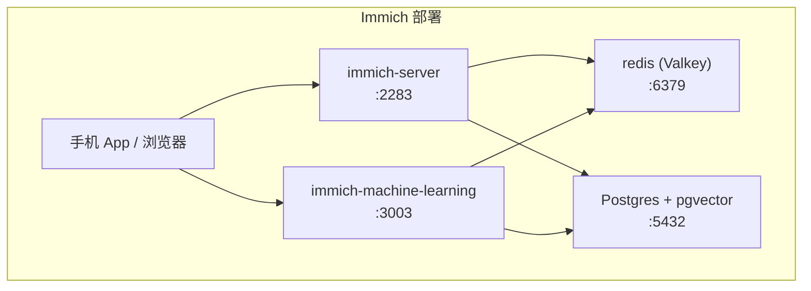

## 引子：月费 20 美元，5 年就是一台中配 MacBook

Google Photos（美国区）2018 年之前免费无限上传，之后 Google 把政策收紧到「高质量」15GB 免费，**Pixel 用户除外**。2026 年，Google One 2TB 套餐约合人民币 130 元/月，100GB 约 21 元/月——折算到 5 年分别是 **7800 元**和 **1260 元**，还不算汇率波动。

国际同行呢？iCloud+ 200GB 约 28 元/月，OneDrive 2TB 约 68 元/月，都是月复一月地交。

国内用户的参照系不太一样：

| 服务 | 套餐 | 月费（2026 年） | 5 年累计 |
|------|------|----------------|----------|
| 阿里云盘超级会员 | 2TB + 极速下载 | 约 30 元/月 | 约 1800 元 |
| 百度网盘超级会员 | 5TB + 极速下载 | 约 30 元/月 | 约 1800 元 |
| 115 网盘会员 | 15TB | 约 80 元/月 | 约 4800 元 |
| 腾讯相册（微云） | 10GB 免费，1TB | 免费 / 约 25 元/月 | 0 / 约 1500 元 |

百度的速度你懂的，115 贵得离谱，阿里云盘这几年体验在改善但隐私条款一直在变。如果照片数量在 2TB 以内、国内云盘够用；但 2TB 以上，「买硬盘自托管」就开始有竞争力了。

**核心问题不是哪个更贵，而是：你的照片值多少？**

---

## 自托管的真实成本账

自托管不是免费，而是**把月费换成了一次性硬件投入 + 电费 + 时间**。

### 硬件：一台旧电脑 or 入门 NAS

| 方案 | 购置成本 | 适合人群 |
|------|----------|----------|
| 闲置旧笔记本（ThinkPad X1 / 旧 MacBook） | 0–1000 元（捡漏或已有） | 技术爱好者，照片 < 2TB |
| 入门 NAS（群晖 DS223 / 威联通 TS-233） | 1500–2500 元 | 家用，需求稳定 |
| 二手服务器（Dell OptiPlex / HP MicroServer） | 500–1500 元 | 7×24 运行，照片 > 5TB |
| 全新 NAS（群晖 DS423+ / 威联通 TS-464C） | 3500–6000 元 | 有钱任性，追求静音低功耗 |

硬盘另算：4TB 西数紫盘（监控盘）约 500 元，4TB 希捷酷狼（NAS 盘）约 700 元。

### 电费：7×24 跑一年多少钱

以入门 NAS 群晖 DS223 为例：

- 功耗：待机约 4W，满载约 10W
- 取中间值 7W，7×24 运行：7W × 24h × 365 = **61.3 度/年**
- 北京民用电约 0.5 元/度（分时电价忽略），年电费约 **30 元**

如果换成 Dell 旧服务器，功耗 30–80W，年电费 130–350 元。

结论：电费不是大头，**硬件折旧才是**。一台 1500 元的 NAS 跑 5 年，每年折旧 300 元，加上电费 30 元，年均成本 330 元——远低于百度网盘 5 年 1800 元。

### 备份介质成本（异地副本）

| 方案 | 月费 | 容量 | 说明 |
|------|------|------|------|
| 阿里云 OSS（归档冷存储） | 约 5 元/TB/月 | 任意 | 需restore才能访问，有延迟 |
| 腾讯云 COS（归档存储） | 约 5 元/TB/月 | 任意 | 同上 |
| Backblaze B2 | $7/TB/月 ≈ 50 元/TB/月 | 任意 | 北美节点，国内访问慢 |
| 群晖 C2（Synology C2） | 约 15 元/TB/月 | 任意 | 群晖用户友好 |

---

## 结构化对比表 1：自托管 vs 国内云盘 vs 国际云盘

| 维度 | 自托管（Immich） | 阿里云盘/百度网盘 | Google Photos/iCloud |
|------|----------------|------------------|---------------------|
| **初始成本** | 硬件 1500–6000 元 | 0 元 | 0 元 |
| **月均摊** | 约 25–50 元/月（5 年摊） | 约 30 元/月 | 约 25–68 元/月 |
| **隐私** | 完全私有，数据在自己硬盘 | 服务商可见（隐私条款） | 美国法律（GPDP/PRISM） |
| **可用性** | 依赖本地电源和网络 | 99.9% 服务商保障 | 99.9% 服务商保障 |
| **迁移成本** | 自己控制，SQLite/原始文件导出 | 受限于下载速度（百度限速臭名昭著） | Google Takeout 可导出 |
| **功能完整度** | 90%（人脸识别、地图相册都有） | 80%（本土相册功能强） | 95%（搜索最强） |
| **远程访问** | 需内网穿透或 Cloudflare Tunnel | 原生 App，国内外都能用 | 原生 App，全球节点 |

---

## 结构化对比表 2：国内常见备份服务价格（2026 年）

| 服务 | 类型 | 价格 | 最低容量 | 特点 |
|------|------|------|----------|------|
| 阿里云 OSS | 对象存储（归档） | ≈¥5/TB/月 | 40GB 起 | 冷存储有 min storage 费用 |
| 腾讯云 COS | 对象存储（归档） | ≈¥5/TB/月 | 50GB 起 | 与微信/腾讯生态集成 |
| Backblaze B2 | 对象存储 | $7/TB/月 ≈ ¥50/TB/月 | 无 | 无下载费，适合备份 |
| 百度网盘 | 个人云盘 | ¥30/月（超级会员） | 5TB | 下载速度是痛点 |
| 群晖 C2 | 云备份 | ≈¥15/TB/月 | 100GB 起 | 与群晖 NAS 原生集成 |

> 注：阿里云/腾讯云归档存储价格不含数据恢复费用（restore 按次计费），大量冷数据不建议频繁恢复。

---

## Immich 的核心能力

Google Photos 的核心功能，Immich 基本都有对位实现：

| Google Photos 功能 | Immich 对应 | 备注 |
|-------------------|-------------|------|
| 设备自动备份 | ✔ 手机 App 上传 | iOS/Android 均有 |
| 人脸识别分组 | ✔ 人脸识别（ML 服务） | 基于 face-detection 模型 |
| 地理位置相册 | ✔ 地图视图 | 依赖 EXIF GPS 数据 |
| 物体/场景识别 | ✔ 机器学习标签 | 使用 torchvision 模型 |
| 搜索（文字/日期/人物） | ✔ 全文搜索 | Postgres 驱动 |
| 分享链接 | ✔ 分享功能 | 可设过期时间 |
| 相册/收藏夹 | ✔ 相册 + 归档 | 支持共享相册（Beta） |
| 回收站 | ✔ 软删除（30 天） | 可配置保留期 |

Immich 没有的：Google 那种 AI 修图、魔法橡皮擦、Magic Eraser 等云端计算功能——这些依赖 Google 的 TPU 集群，家庭硬件短期追不上。

下图是 Immich Web UI 的真实截图（取自原作者的 demo 实例），可以看到左侧地图视图、中间时间线、右侧人脸/物体识别的整体布局：


---

## 架构总览

Immich 由 4 个 Docker 服务组成，通过 Docker Compose 协同：



- **immich-server**：主 API 服务，处理上传、下载、元数据查询
- **immich-machine-learning**：机器学习推理（人脸、物体识别），首次启动需下载约 2GB 模型
- **redis（Valkey）**：缓存 + 任务队列（Sidekiq/BullMQ 风格）
- **Postgres + pgvector**：关系数据（用户、相册） + 向量索引（人脸特征向量）

外层反向代理（Nginx / Traefik）可选，加 SSL 证书后可直接暴露公网域名，省去内网穿透步骤。

---

## 部署实操

### docker-compose.yml（完整配置）

```yaml
version: "3.8"

services:
  # 主 API 服务，端口 2283
  immich-server:
    image: ghcr.io/immich-app/immich-server:${IMMICH_VERSION:-release}
    container_name: immich-server
    command: ["start.sh", "immich"]
    restart: unless-stopped
    ports:
      - "2283:3001"          # 主机 2283 映射到容器 3001
    volumes:
      - ${UPLOAD_LOCATION}:/usr/src/app/upload        # 照片存储路径
      - ./immich-db:/var/lib/postgresql/data          # Postgres 数据持久化
    environment:
      DB_DATA_LOCATION: /var/lib/postgresql/data      # 数据库文件位置
      UPLOAD_LOCATION: /usr/src/app/upload            # 用户照片存储位置
      IMMICH_VERSION: ${IMMICH_VERSION:-release}
      DB_PASSWORD: ${DB_PASSWORD}                    # Postgres 密码（来自 .env）
      DB_USERNAME: ${DB_USERNAME:-immich}
      DB_DATABASE_NAME: ${DB_DATABASE_NAME:-immich}
    depends_on:
      - redis                                        # 依赖 Valkey 启动完成
      - database

  # 机器学习服务，人脸识别 + 物体检测
  immich-machine-learning:
    image: ghcr.io/immich-app/immich-machine-learning:${IMMICH_VERSION:-release}
    container_name: immich-ml
    restart: unless-stopped
    volumes:
      - model-cache:/cache                           # 模型缓存，避免每次重启重新下载
    ports:
      - "3003:3001"                                  # ML API 端口（仅内部通信）

  # 缓存 + 任务队列（Valkey，是 Redis 的 fork，性能更好）
  redis:
    image: valkey/valkey:7-alpine
    container_name: immich-redis
    restart: unless-stopped
    ports:
      - "6379:6379"
    volumes:
      - redis-data:/data                             # Valkey 数据持久化

  # Postgres 数据库，Immich v1.107+ 内置 pgvector 向量扩展
  database:
    image: tensorchord/pgvecto:pg-16-v0.3.0
    container_name: immich-db
    restart: unless-stopped
    ports:
      - "5432:5432"
    volumes:
      - ./immich-db:/var/lib/postgresql/data         # 数据库文件持久化到主机目录
    environment:
      POSTGRES_PASSWORD: ${DB_PASSWORD}             # 密码来自 .env，不要硬编码
      POSTGRES_USER: ${DB_USERNAME:-immich}
      POSTGRES_DB: ${DB_DATABASE_NAME:-immich}
      POSTGRES_INITDB_ARGS: "--encoding=UTF-8"

volumes:
  redis-data:                                        # Valkey 数据卷
  model-cache:                                       # ML 模型缓存卷
```

### .env 环境变量

```bash
# 版本管理：release = 自动跟踪最新发布版，也可指定 v1.107.0 固定版本
IMMICH_VERSION=release

# 照片存储路径（建议用绝对路径）
UPLOAD_LOCATION=/path/to/immich-data/library

# 数据库配置
DB_PASSWORD=生成一个随机强密码        # 必填，建议 32 位随机字符串
DB_USERNAME=immich                      # 默认即可
DB_DATABASE_NAME=immich                 # 默认即可
```

### 启动命令

```bash
# 创建数据目录
mkdir -p ~/immich-data/library
mkdir -p ~/immich-db
mkdir -p ~/redis-data

# 生成随机密码（Linux/Mac）
openssl rand -base64 32

# 启动 4 个服务（后台运行）
sudo docker compose up -d

# 查看服务状态
sudo docker compose ps

# 查看日志（调试用）
sudo docker compose logs -f immich-server
```

### 确认私有 IP

```bash
# Linux 获取本机局域网 IP
hostname -I | awk '{print $1}'

# Mac：系统设置 → 网络 → Wi-Fi/以太网 → IP 地址
# Windows：设置 → 网络 → 查看网络属性 → IPv4 地址

# 假设得到 192.168.1.100，浏览器访问：
# http://192.168.1.100:2283
```

### 手机 App

- **Android**：Google Play / [F-Droid](https://f-droid.org/packages/org.immich.immich/) / [Obtainium](https://github.com/Obtainium/Obtainium)（支持自架 APK 更新源）
- **iOS**：App Store 搜索 "Immich"
- App 首次打开填入服务器地址：`http://192.168.1.100:2283`，局域网直连无需 SSL

---

## 存储容量表

以单张照片平均 3–5MB（手机直出 JPEG）、开启 HEIF 高效格式后约 2MB 估算：

| 硬盘容量 | 3MB/张 | 2MB/张 | 典型场景 |
|----------|--------|--------|----------|
| 250GB | ~83,000 张 | ~125,000 张 | 普通家庭 1–2 年 |
| 500GB | ~166,000 张 | ~250,000 张 | 家庭 3–5 年 |
| 1TB | ~333,000 张 | ~500,000 张 | 5 年以上 + 4K 视频 |
| 2TB | ~666,000 张 | ~1,000,000 张 | 摄影师、vlogger |

> 4K 60fps 视频 1 分钟约 300MB，拍摄频繁的用户建议预留更多空间或启用 video transcoding 限制。

---

## 照片存储位置

`UPLOAD_LOCATION` 默认指向 `./library`，Docker Compose 配置下完整目录结构如下（参考原文截图）：


示意结构：

```
~/immich-data/
├── library/                      # 用户照片主目录（挂载到容器内 /usr/src/app/upload）
│   ├── thumbs/                   # 缩略图（Immich 生成，供列表页快速加载）
│   ├── encoded-video/            # 转码后视频（可节省播放解码开销）
│   ├── profile/                  # 用户头像
│   └── upload/                   # 原始文件，按年/月/日分目录存放
│       └── 2026/
│           └── 09/
│               └── 03/
│                   └── IMG_0001.jpg
├── postgres/                     # Postgres 数据目录（独立 volume）
│   └── pg_wal/                   # WAL 日志，备份时不要漏掉
└── redis/                        # Valkey 数据目录（独立 volume）
    └── dump.rdb                  # Valkey 持久化文件
```

**备份时注意**：`postgres/` 目录包含 pgvector 向量索引，丢失后需重新跑 ML 识别才能恢复人脸/物体标签，比原始文件更难重建。务必将 `postgres/` 和 `library/upload/` **一起备份**。

---

## 备份策略三档

### 档位 1：外置 HDD（最低成本）

```bash
# 每周手动插上外置硬盘，同步增量
rsync -av --delete ~/immich-data/library/upload/ /mnt/backup-hdd/immich-uploads/
rsync -av --delete ~/immich-data/postgres/ /mnt/backup-hdd/immich-postgres/
```

- 优点：零月费，即插即用
- 缺点：无冗余、无异地、依赖人工

### 档位 2：Backblaze B2 + Cloudflare（主流推荐）

```bash
# 使用 rclone 增量备份到 B2
rclone sync ~/immich-data/library/upload/ b2:my-immich-bucket/library-upload \
  --transfers 4 \
  --bwlimit 10M \
  --exclude "thumbs/**" \
  --exclude "encoded-video/**"

rclone sync ~/immich-data/postgres/ b2:my-immich-bucket/immich-postgres
```

- Backblaze B2 $7/TB/月 ≈ 50 元/TB/月，无流量下载费
- Cloudflare 免费 CDN 加速，国内外访问速度可接受
- thumbs 目录排除可节省 30–50% 备份体积（缩略图可重新生成）

### 档位 3：群晖 RAID1 / RAID5（本地冗余）

- 群晖 NAS 可组 RAID1（双盘镜像）或 SHR（Synology Hybrid RAID，接近 RAID5）
- 单盘故障不丢数据，适合技术能力一般、懒得管备份的用户
- 缺点：同地理位置，无法防火灾/盗窃

---

## 远程访问

原文没有详细讨论这点，但国内网络环境有特殊挑战：**家庭宽带封 80/443 端口**，有公网 IPv6 还好，没有的话只能走内网穿透。

### 方案 1：Cloudflare Tunnel（推荐，国际用户）

```bash
# 安装 cloudflared
curl -L https://github.com/cloudflare/cloudflared/releases/latest/download/cloudflared-linux-amd64 -o cloudflared
chmod +x cloudflared

# 一条命令建立隧道（需要 CF 账号 + 已托管域名）
cloudflared tunnel --url http://localhost:2283
```

- 无需公网 IP，无需配置路由器
- Cloudflare Access 可加密码保护（防爬虫）
- 国内访问速度依赖 Cloudflare 国内边缘节点（目前质量一般）

### 方案 2：frp 内网穿透（国内网络现实解法）

frp（fast reverse proxy）是国内最流行的开源内网穿透工具：

```bash
# frps.ini（具有公网 IP 的云服务器上）
[common]
bind_port = 7000
vhost_http_port = 8080

# frpc.ini（Immich 所在的家庭设备上）
[common]
server_addr = your-vps-ip
server_port = 7000

[immich]
type = http
local_ip = 127.0.0.1
local_port = 2283
custom_domains = immich.yourdomain.com
```

- 国内访问速度好（走国内服务器）
- 需要一台有公网 IP 的 VPS（月均 30–50 元）
- 需配置域名 + Let's Encrypt 证书

### 方案 3：PikaPods 托管（最简单）

[PikaPods.com](https://www.pikaPods.com) 提供 Immich 一键托管，按小时计费：

- 无需自备服务器
- 隐私数据在 PikaPods 管理的 VPS 上
- 月费约 $5–10，比自建贵但省心

---

## 国内工程师关心的 5 个坑

### 坑 1：机器学习模型首次下载约 2GB

Immich 部署后首次打开「人脸识别」或「智能相册」功能时，`immich-machine-learning` 容器会从 HuggingFace 下载推理模型（人脸检测.clip 模型等），约 2GB。国内家庭带宽 100Mbps 还好，但 20Mbps 小水管可能需要 15–20 分钟。

**解法**：在部署前手动拉取镜像 + 模型：

```bash
docker pull ghcr.io/immich-app/immich-machine-learning:release
# 确保 model-cache volume 持久化，重启后不再重新下载
```

### 坑 2：pgvector 索引对 5 万张照片以上内存占用飙升

Postgres + pgvector 存储人脸特征向量（512 维 float32），5 万张照片约 50 万个人脸向量，每次新增照片都要更新 HNSW 索引。pgvector 官方建议 2GB 内存起步，10 万张照片建议 4GB+。

**症状**：`docker compose up` 能起来，但上传 1000 张照片后 Postgres OOM killed。

**解法**：
- 给 Postgres 容器加内存限制：`mem_limit: 2g`
- 定期手动触发索引重建（Immich 管理员面板 → 重建缩略图/索引）

### 坑 3：移动端后台同步被系统限制

iOS 后台 App 刷新限制导致 Immich App 在锁屏后约 30 秒停止上传；Android 的 Doze 模式更激进，息屏 30 分钟后几乎完全停止后台任务。

**解法**：
- iOS：设置 → Immich → 打开后台 App 刷新；保持前台开着直到上传完
- Android：电池设置 → 允许 Immich 忽略电池优化（白名单）；华为/小米需额外放行自启动

### 坑 4：EXIF GPS 坐标暴露家庭住址

照片 EXIF 数据包含 GPS 坐标，Immich 地图相册直接读取这些数据。如果手机拍了家庭室内照片，原图上传后坐标点精确到你家小区——这是隐私风险。

**解法**：
- 上传前用 `exiftool` 清除 GPS 数据：`exiftool -gps:all= *.jpg`
- Immich 管理员可全局禁用地图功能（`--disable-map` 启动参数）

### 坑 5：备份 3-2-1 法则说起来容易做起来难

3-2-1 法则：3 份副本、2 种介质、1 份异地。对于家庭用户来说：

- 1 份：NAS 本地
- 2 份：外置 HDD（同城父母家）
- 3 份：B2/COS 云端

**现实难度**：B2/COS 在国内访问速度慢，恢复 1TB 数据可能需要 2–3 天。

---

## 决策 Checklist：是否值得自托管？

回答以下 8 个问题，超过 5 个「是」→ 自托管适合你：

1. **照片数量 > 10,000 张？**（< 5000 张国内云盘够用）
2. **家庭上行带宽 ≥ 20Mbps？**（移动/广电宽带上行只有 2–5Mbps，远程访问会很痛苦）
3. **有一台能 7×24 开机的设备？**（旧笔记本 + 硬盘 or 入门 NAS）
4. **愿意每周花 30 分钟做维护？**（更新 Docker 镜像、检查硬盘健康）
5. **对隐私有强烈诉求？**（家庭照片、医疗记录、孩子照片不想放云盘）
6. **有异地备份条件？**（父母家/工作室有第二台 NAS，或愿意每月付 B2 ¥20）
7. **有一定 Linux / Docker 基础？**（能看懂 docker compose logs，能重启服务）
8. **讨厌百度网盘的下载限速？**（这是很多技术用户转自托管的直接诱因）

---

## 结语

自托管不是技术问题，是**时间预算问题**。

如果你每年愿意花 10–15 小时维护（更新、Docker 清理、备份验证），5 年摊下来月均成本约 15–25 元，远低于 Google Photos 的月费。隐私完全自主，没有服务商跑路风险。

但如果你每年找不到这 10 小时，百度网盘 30 元/月买的是省心——技术服务的价值本来就应该被定价。

**照片是时间的容器**。不管选哪条路，定期备份都是最重要的。

---

## 参考与延伸阅读

- 原英文原文：[Saving money on Google Photos with Immich](https://www.markpitblado.me/blog/saving-on-google-photos-with-immich-your-own-personal-photo-storage/)
- Immich 官方文档：[meichthys.github.io/foss_photo_libraries](https://meichthys.github.io/foss_photo_libraries/)
- Immich GitHub：[github.com/immich-app/immich](https://github.com/immich-app/immich)
- pgvector + Immich 性能调优参考：[github.com/immich-app/immich/discussions](https://github.com/immich-app/immich/discussions)
